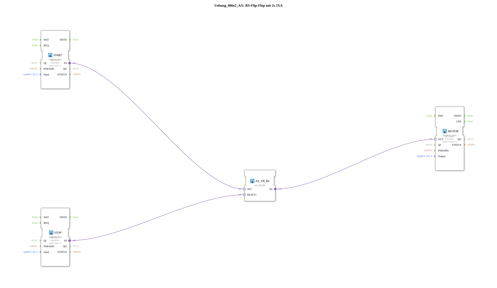

Here is the documentation page for exercise `Uebung_006e2_AX`, based on the provided XML data.
# Exercise_006e2_AX: RS Flip-Flop with 2x IXA

* * * * * * * * * *
## Introduction
Exercise **Exercise_006e2_AX** implements an RS flip-flop (reset dominant) using adapter connections (AX). The goal of the exercise is to use two digital inputs to set or reset a digital output. The logic block library for bistable elements is used and abstracted from the hardware via the logiBUS system.

## Function Blocks Used

This sub-application uses specific function blocks for input and output as well as logical processing.

### Sub-Blocks: Exercise_006e2_AX

This exercise itself is defined as `SubAppType` and contains the following internal components:

- **Type**: SubAppType
- **Internal Function Blocks Used**:
- **DigitalInput_I1**: `logiBUS::io::DI::logiBUS_IXA`
- Parameter: `Input` = "Input_I1"
- Parameter: `QI` = "TRUE"
- Description: Adapter block for the first digital input.
- **DigitalInput_I2**: `logiBUS::io::DI::logiBUS_IXA`
- Parameter: `Input` = "Input_I2"
- Parameter: `QI` = "TRUE"
- Description: Adapter chip for the second digital input.
- **DigitalOutput_Q1**: `logiBUS::io::DQ::logiBUS_QXA`
- Parameter: `Output` = "Output_Q1"
- Parameter: `QI` = "TRUE"
- Description: Adapter chip for the digital output.
- **AX_FB_RS**: `adapter::iec61131::bistableElements::AX_FB_RS`
- Description: A bistable element (RS flip-flop) with adapter interfaces. It implements the memory function.
- **Functionality**:

The sub-application reads two external signals via the logiBUS adapters, processes them in an RS flip-flop, and passes the resulting state to an output adapter.

## Program Flow and Connections

The program flow is implemented through adapter connections (`AdapterConnections`), which encapsulate both data and events.

1. **Setting the Memory (Set):**

- The adapter `DigitalInput_I1.IN` is connected to the adapter input `AX_FB_RS.SET`.
- When the input `Input_I1` is activated, the RS flip-flop is set.

2. **Reset the Memory:**

- Adapter `DigitalInput_I2.IN` is connected to adapter input `AX_FB_RS.RESET1`.
- When input `Input_I2` is activated, the RS flip-flop is reset.

3. **State Output:**

- Adapter output `AX_FB_RS.Q1` is connected to adapter `DigitalOutput_Q1.OUT`.
- The current state of the flip-flop is thus directly passed to the physical output `Output_Q1`.

**Learning Objectives:**

- Understanding bistable elements (RS flip-flop).
- Using adapter connections (AX/IXA/QXA) in 4diac to simplify signal flow.
- Linking hardware I/Os with logic functions.

## Summary
The `Uebung_006e2_AX` demonstrates a basic memory function in control engineering. By using adapters (`AX_FB_RS`, `logiBUS_IXA`, `logiBUS_QXA`), the circuit diagram remains clear, as event and data flows are combined in a single connection. The behavior corresponds to a classic RS flip-flop, where `Input_I1` acts as the set input and `Input_I2` as the reset input.

---

### 🌐 Related topic subpages on ms-muc-docs.de
* [🌐 Eclipse 4diac IDE & Color Reference on ms-muc-docs.de](https://www.ms-muc-docs.de/iec-61499/eclipse-4diac/)

]
