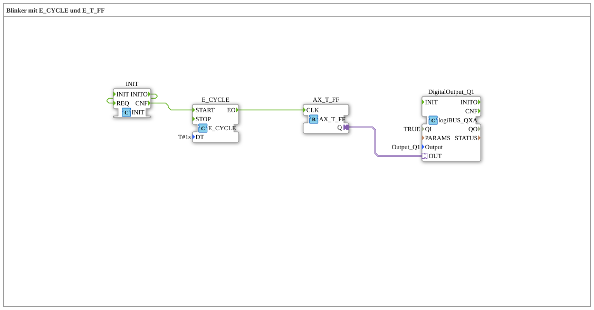

# Exercise_007_AX: Flasher with E_CYCLE and E_T_FF

This article describes the logiBUS® exercise `Uebung_007_AX`. It demonstrates how to generate time-controlled events.

----

## Objective of the Exercise

Generating a periodic flashing signal.

-----

## Description and Components

[cite_start]The subapplication `Uebung_007_AX.SUB` uses a `E_CYCLE` function block in combination with a flip-flop[cite: 1].

### Function Blocks (FBs)

* **`E_CYCLE`**: An event generator. It periodically sends events to output `EO`. The parameter `DT` determines the period (here `T#1s`).

* **`AX_T_FF`**: The toggle flip-flop.

* **`DigitalOutput_Q1`**: The lamp.

-----

## Functionality

1. The `E_CYCLE` function block fires an event every second.

2. The event reaches the flip-flop (`AX_T_FF.CLK`).

3. The flip-flop switches (On -> Off -> On...).

4. The lamp flashes at a frequency of 0.5 Hz (1 second on, 1 second off).

-----

## Application Example

**Warning Light**: A signal lamp should flash to attract attention.