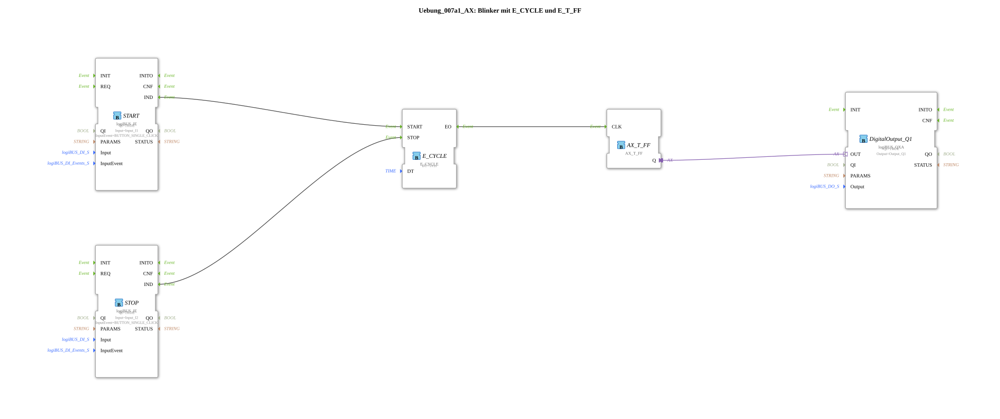

# Exercise_007a1_AX: Flasher with E_CYCLE and E_T_FF

This article describes the logiBUS® exercise `Uebung_007a1_AX`.
----
## Objective of the exercise

Starting and stopping the flasher.

-----

## Description and components

[cite_start]The subapplication `Uebung_007a1_AX.SUB` uses the inputs `START` and `STOP` of the `E_CYCLE` block[cite: 1].

### Function Blocks (FBs)

* **`START` (I1)**: Starts the cycle.
* **`STOP` (I2)**: Stops the cycle.
* **`E_CYCLE`**: Generates events only when it is started.

-----

## Problem

As noted in the subapplication comment ("this blinker randomly stays ON or OFF"):

When `STOP` is pressed, `E_CYCLE` stops sending events. However, the flip-flop `AX_T_FF` retains its *last* state. If the light was just on, it remains on permanently. This is usually undesirable (a stopped warning light should be off).

-----

## Application Example

Shows why the "stop state" must be defined when designing state machines.
