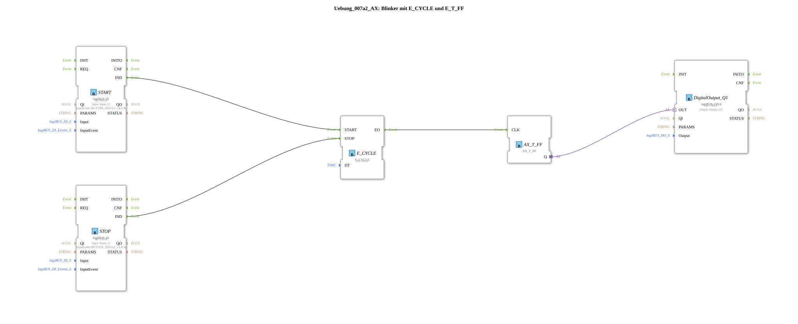

# Exercise_007a2_AX: Flasher with E_CYCLE and E_T_FF

This article describes the logiBUS® exercise `Uebung_007a2_AX`.
----
## Purpose of the Exercise
Investigation of the behavior.

-----

## Description

[cite_start]Structurally very similar to `Uebung_007a1_AX`[cite: 1]. Here, too, the problem of the lamp's undefined final state exists. It presumably serves as a repetition or variation in the layout.

-----

## Conclusion

This solution is also unsuitable for safety-critical flashers.

