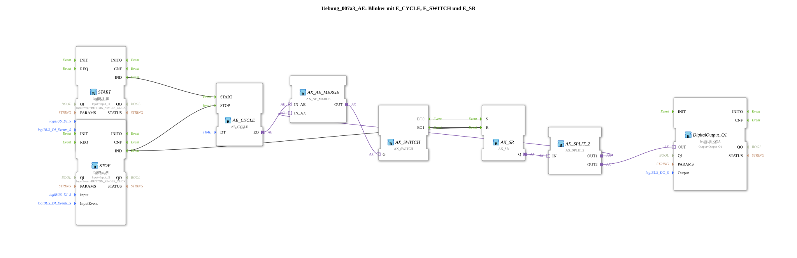

# Exercise_007a3_AE: Flasher with E_CYCLE, E_SWITCH, and E_SR

* * * * * * * * * *
## Introduction

This exercise describes the implementation of a flasher that periodically switches a digital output (Output_Q1) on and off. It is controlled by two pushbuttons (Start/Stop). The key components used are the function blocks `AE_CYCLE` (Timer), `AX_SWITCH` (Changeover Switch), `AX_SR` (Set-Reset Flip-Flop), and other adapter blocks. A special feature of this circuit is that the output remains permanently off when switched off – there is no unintended activation.

## Function Blocks (FBs) Used

- **DigitalOutput_Q1** (Type: `logiBUS::io::DQ::logiBUS_QXA`)
- Parameters: `QI` = TRUE, `Output` = "Output_Q1"
- Adapter block for controlling a physical digital output.
- **AE_CYCLE** (Type: `adapter::events::unidirectional::timers::AE_CYCLE`)
- Parameter: `DT` = T#1s (Period 1 second)
- Cyclic timer that outputs an event at regular intervals after a start event.
- **START** (Type: `logiBUS::io::DI::logiBUS_IE`)
- Parameters: `QI` = TRUE, `Input` = "Input_I1", `InputEvent` = "BUTTON_SINGLE_CLICK"
- Input block for a push button. A single button press triggers an event `IND`.
- **STOP** (Type: `logiBUS::io::DI::logiBUS_IE`)
- Parameters: `QI` = TRUE, `Input` = "Input_I2", `InputEvent` = "BUTTON_SINGLE_CLICK"
- Same type as START, used to stop the timer and reset the flip-flop.
- **AX_SR** (Type: `adapter::events::unidirectional::AX_SR`)
- Event-driven set/reset flip-flop. The inputs `S` (Set) and `R` (Reset) are activated by events; the output `Q` provides an adapter signal.
- **AX_SWITCH** (Type: `adapter::events::unidirectional::AX_SWITCH`)
- Event-driven switch. Depending on the value of the input `G`, the incoming signal is routed to either output `EO0` or `EO1`.
- **AX_AE_MERGE** (Type: `adapter::events::unidirectional::AX_AE_MERGE`)
- Combines an adapter input (`IN_AX`) and an event input (`IN_AE`) into a single output signal (`OUT`).
- **AX_SPLIT_2** (Type: `adapter::events::unidirectional::AX_SPLIT_2`)
- Distributes an incoming adapter signal to two identical outputs (`OUT1` and `OUT2`).

## Program Flow and Connections

1. **Start** – Pressing a key on Input_I1 (START) generates an event `IND`, which is routed to the `START` input of `AE_CYCLE`. The timer starts running.
2. **Stop** – Pressing a key on Input_I2 (STOP) generates an event `IND`, which is sent to both the `STOP` input of `AE_CYCLE` (timer stops) and the `R` input of `AX_SR` (flip-flop is reset).
3. **Cycle** – The timer `AE_CYCLE` generates an event at its output `EO` every second. This event is combined with the adapter signal from `AX_SR` (`Q`) via `AX_AE_MERGE` and sent to the `G` input of `AX_SWITCH`.

This event is combined with the adapter signal from `AX_SR` (`Q`) via `AX_AE_MERGE` and sent to the `G` input of `AX_SWITCH`.

... 4. **Switching** – `AX_SWITCH` forwards the incoming signal (from the merge) to either `G`, depending on its level, to `EO0` (connected to `S` of `AX_SR`) or to `EO1` (connected to `R` of `AX_SR`). This toggles the flip-flop's state with each timer pulse.

5. **Output** – The output `Q` from `AX_SR` is distributed via `AX_SPLIT_2` in two ways:
- `OUT1` goes back to `AX_AE_MERGE` (via `IN_AX`) to close the feedback loop.
- `OUT2` is routed to the input `OUT` of `DigitalOutput_Q1` and switches the physical output (Output_Q1).

**Learning Objectives**

- Understanding event-driven sequence control with timers, flip-flops, and toggle switches.
- Working with adapter modules in the 4diac IDE.

**Difficulty Level**: Medium

**Prerequisites**: Basic knowledge of the 4diac IDE and event-driven function blocks.

**Getting Started**: After loading the SubApp into a project, it can be tested by assigning the inputs/outputs to the hardware.

## Summary

Exercise **Exercise_007a3_AE** demonstrates a robust blinker implemented using a combination of a cyclic timer, a toggle switch, and a set/reset flip-flop. The specific circuitry ensures that the output remains reliably switched off after a stop. This setup is ideal for introducing event-driven logic with adapters and shows how a functional control program can be created from simple basic blocks.

---

### 🌐 Related topic subpages on ms-muc-docs.de

- [🌐 Eclipse 4diac IDE & Color Reference on ms-muc-docs.de](https://www.ms-muc-docs.de/iec-61499/eclipse-4diac/)
