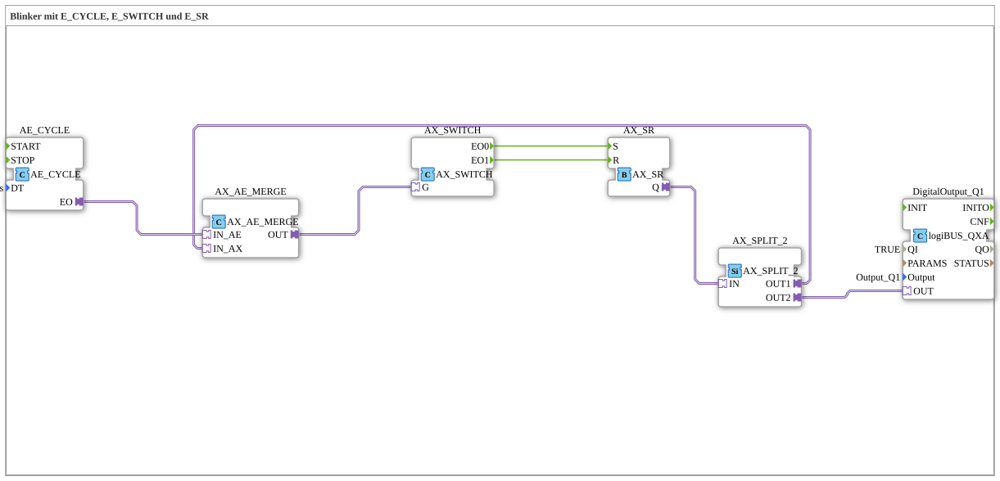

# Exercise_008_AE: Flasher with E_CYCLE, E_SWITCH, and E_SR



* * * * * * * * * *
## Introduction

This exercise implements a simple flasher (alternating flasher) using adapter function blocks (FBs) for event-driven logic. The core consists of a cycle generator (AE_CYCLE), a toggle switch (AX_SWITCH), and an SR flip-flop (AX_SR). Feedback and output to a digital output are implemented via a split (AX_SPLIT_2) and a merger (AX_AE_MERGE). This exercise demonstrates the use of event and adapter connections in the 4diac IDE.


## Function Blocks (FBs) Used

All function blocks used are adapter FBs from the libraries `adapter::events::unidirectional::timers` and `adapter::events::unidirectional`. Additionally, a hardware output (logiBUS) is used.

### AE_CYCLE
- **Type**: `adapter::events::unidirectional::timers::AE_CYCLE`
- **Parameters**:

- `DT` = `T#1s` (cycle time 1 second)
- **Event Output**:

- `EO`: Cyclic event pulse every 1 second
- **Function**: Generates a periodic event pulse. Used as a clock for the flasher.


### AX_SWITCH
- **Type**: `adapter::events::unidirectional::AX_SWITCH`
- **Parameters**: None
- **Event Input**:

- `G`: Switch input (Gate)
- **Event Outputs**:

- `EO0`: Active when the incoming event is "Off"

- `EO1`: Active when the incoming event is "On"

- **Function**: Switches an incoming event to either output 0 or 1, depending on the current state of an internal switch. Here, the returned event is fed via `AX_AE_MERGE.OUT` to the gate input, alternately triggering the set (S) and reset (R) of the SR flip-flop.


### AX_SR
- **Type**: `adapter::events::unidirectional::AX_SR`
- **Parameters**: None
- **Event Inputs**:

- `S`: Set (event sets output Q to true)

- `R`: Reset (event sets output Q to false)

- **Adapter Output**:

- `Q`: Adapter output (carries the Boolean state; passed to the divider)

- **Function**: Implements an SR flip-flop at the event level. Output Q is set to S on a pulse and reset to R on a pulse.


### AX_SPLIT_2
- **Type**: `adapter::events::unidirectional::AX_SPLIT_2`
- **Parameters**: None
- **Adapter Input**:

- `IN` (Input of an adapter that takes the state of the SR flip-flop)

- **Adapter Outputs**:

- `OUT1`: First copy of the input (used for feedback to the switch)

- `OUT2`: Second copy of the input (routed to the digital output)

- **Function**: Distributes the incoming adapter (state) across two parallel paths.


### AX_AE_MERGE
- **Type**: `adapter::events::unidirectional::AX_AE_MERGE`
- **Parameters**: None
- **Adapter Inputs**:

- `IN_AX`: Adapter input (state from the splitter)

- `IN_AE`: Event input (from the cycle encoder)
- **Adapter/Event Output**:

- `OUT`: Adapter output (combines the adapter state with the event)

- **Function**: Connects an adapter (data state) to an event. The outgoing adapter contains the state of `IN_AX` and is triggered by the event `IN_AE`. This passes the current state of the SR flip-flop to the switch as soon as the cycle event occurs.


### DigitalOutput_Q1

- **Type**: `logiBUS::io::DQ::logiBUS_QXA`
- **Parameters**:

- `QI` = `TRUE` (always enabled)

- `Output` = `Output_Q1` (physical output channel)

- **Adapter Input**:

- `OUT` (receives the Boolean state of `AX_SPLIT_2.OUT2`)

- **Function**: Switches the physical digital output Q1 according to the applied Boolean value (TRUE = on, FALSE = off). The output illuminates when the SR flip-flop is set.


## Program Flow and Connections

The blinker operates event-driven according to the following scheme:

1. **Clock Generator**: The `AE_CYCLE` sends an event to its output `EO` every 1 second.

2. **Event Feedback**: The event from `AE_CYCLE` is combined with the current state of the SR flip-flop. For this purpose, the state from `AX_SR` is routed via `AX_SPLIT_2` to `AX_AE_MERGE` (input `IN_AX`). The event from `AE_CYCLE` is applied to `IN_AE`. The `AX_AE_MERGE` outputs an adapter, `OUT`, which carries the current state and is delivered simultaneously with the event.

3. **Switch**: The output `AX_AE_MERGE.OUT` is connected to the input `G` of the `AX_SWITCH`. The switch evaluates the incoming adapter state:

- If the state `false` (flip-flop reset) is reached, an event is output to `EO0`.

- If the state `true` (flip-flop set) is reached, an event is output to `EO1`.

4. **SR Flip-Flop**:

- An event from `AX_SWITCH.EO0` reaches the set input `S` of `AX_SR`. This sets the flip-flop → output `Q` becomes `true`.

- An event from `AX_SWITCH.EO1` reaches the reset input `R` of `AX_SR`. This resets the flip-flop → output `Q` becomes `false`.

5. **Output**: The state `Q` is distributed to two paths via `AX_SPLIT_2`:

- `OUT1` → Feedback to `AX_AE_MERGE` (as described)

- `OUT2` → To the adapter input `OUT` of `DigitalOutput_Q1`. The output is switched on at `true` and switched off at `false`.

This cycle repeats with each clock pulse of `AE_CYCLE`. As a result, output Q1 toggles periodically between on and off (blinking every 1 second).


## Summary

Exercise "Exercise_008_AE" demonstrates the construction of a blinker using 4diac adapters. The key components are `AE_CYCLE` (clock), `AX_SWITCH` (state processing), `AX_SR` (flip-flop), `AX_SPLIT_2` (signal distribution), and `AX_AE_MERGE` (event-adapter combination). The event-based feedback creates a toggling on/off logic that is output to a physical output. This exercise teaches how to work with adapter connections, event feedback, and design sequential circuits in the 4diac IDE.


``` ---

### 🌐 Related topic subpages on ms-muc-docs.de

* [🌐 Eclipse 4diac IDE & Color Reference on ms-muc-docs.de](https://www.ms-muc-docs.de/iec-61499/eclipse-4diac/)

]