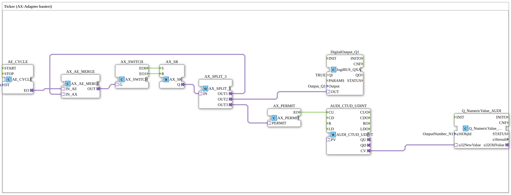

# Exercise_009_AUDI: Ticker (AX-Adapter Based)

* * * * * * * * * *
## Introduction

This exercise demonstrates the implementation of a **ticker** based on **AX adapters** (adapter event interfaces) in the 4diac IDE.
The goal is to implement an up/down counter controlled by a switch (AX_SWITCH), a set/reset gate (AX_SR), and a permit signal (AX_PERMIT). The current counter value is output on a digital output and a numeric display.

This exercise is part of the **Exercises** library and uses predefined adapter blocks and a CTUD counter. It is suitable for advanced users who want to understand the interaction of events and adapters.

## Function Blocks (FBs) Used

This exercise consists of a **SubApp** (Exercise_009_AUDI) containing several internal function blocks. The SubApp itself has no dedicated input/output interfaces; all signals are processed via internal connections.

### Sub-Blocks: Exercise_009_AUDI (SubApp)

- **Type**: SubAppType
- **Internal FBs Used**:
- **DigitalOutput_Q1**: `logiBUS::io::DQ::logiBUS_QXA`
- Parameters: `QI` = `TRUE`, `Output` = `Output_Q1`
- Function: Provides the digital output `Output_Q1` on the logiBUS.
- **AE_CYCLE**: `adapter::events::unidirectional::timers::AE_CYCLE`
- Parameters: `DT` = `T#1s`
- Function: Cyclically generates an event at its output `EO` every 1 second.
- **AX_SWITCH**: `adapter::events::unidirectional::AX_SWITCH`
- Parameters: None
- Function: An AX adapter switch with two event outputs (`EO0`, `EO1`). Which output is activated depends on the incoming adapter event (toggle function).
- **AX_SR**: `adapter::events::unidirectional::AX_SR`
- Parameters: None
- Function: Set/reset memory with AX adapter interface. Inputs `S` and `R` set and reset the output `Q`, respectively.
- **AX_PERMIT**: `adapter::events::unidirectional::AX_PERMIT`
- Parameters: None
- Function: An enable gate: Only if an event arrives at input `PERMIT` is the event at `IN` forwarded to output `EO`.
- **AUDI_CTUD_UDINT**: `adapter::events::unidirectional::AUDI_CTUD_UDINT`
- Parameters: none
- Function: Counter with forward counting (CU) and optional counting direction. Returns the current counter value as `UDINT` to `CV`.
- **Q_NumericValue_AUDI**: `isobus::UT::Q::Q_NumericValue_AUDI`
- Parameters: `u16ObjId` = `OutputNumber_N1`
- Function: Outputs the passed numeric value (`u32NewValue`) to an ISOBUS network (object ID `OutputNumber_N1`).
- **AX_SPLIT_3**: `adapter::events::unidirectional::AX_SPLIT_3`
- Parameters: None
- Function: Distributes an incoming AX event to three outputs (`OUT1`, `OUT2`, `OUT3`).
- **AX_AE_MERGE**: `adapter::events::unidirectional::AX_AE_MERGE`
- Parameters: None
- Function: Combines two event inputs: an AX adapter (`IN_AX`) and a pure event input (`IN_AE`). The combined signal is output at `OUT`.

## Program Flow and Connections

The exercise flow can be described as follows:

1. **Clock Generation**

AE_CYCLE` generates an event (EO) every 1 second.

2. **Event Combining**

This event is combined with the signal from `AX_SPLIT_3.OUT1` (see step 4) via `AX_AE_MERGE`. The result is forwarded to `AX_SWITCH.G` (gate input).

3. **Switching Operation**

AX_SWITCH` reacts to the incoming event and switches between its two outputs, `EO0` and `EO1`. This simulates a manual or logical switching operation.

4. **Set-Reset Circuit**

EO0` goes to `AX_SR.S` (Set), `EO1` to `AX_SR.R` (Reset). The output `Q` of the SR circuit is active while set and deactivated upon reset.

5. **Signal Distribution**

The signal from `AX_SR.Q` is sent to `AX_SPLIT_3.IN` and distributed to three outputs:

- `OUT1` → back to the event junction `AX_AE_MERGE.IN_AX`.

- `OUT2` → to the **digital output** `DigitalOutput_Q1.OUT`. This sets the output `Output_Q1` as long as the SR element is set.

- `OUT3` → to `AX_PERMIT.PERMIT`.
6. **Allowance and Counter**

AX_PERMIT` only forwards the event to `EO` if an event is present at the `PERMIT` input. This event is then sent to the counter `AUDI_CTUD_UDINT.CU`. The counter increments its value with each event.

7. **Numerical Output**

The current counter reading (`CV`) is passed to the `Q_NumericValue_AUDI` block and output as a numeric value on the isobus network (object ID `OutputNumber_N1`).

**Learning Objectives**:

- Understanding AX and AE adapters (event and adapter interfaces)
- Using an SR memory, a switch, and an enable gate
- Linking cyclic events with manual control
- Output on digital and numeric channels

**Difficulty Level**: Advanced
**Prerequisites**: Basic knowledge of the 4diac IDE, event-driven processes, working with adapters

## Summary

Exercise `Uebung_009_AUDI` implements a ticker-controlled counter using AX adapter blocks.

A cyclic timer (`AE_CYCLE`) provides the clock signal, which enables the counter via a switch (`AX_SWITCH`) and a set/reset gate (`AX_SR`). The meter reading is simultaneously output as a digital signal on a logiBUS output and as a numerical value on an isobus network.

The use of adapters allows for flexible, event-driven chaining and demonstrates the modular structure of the 4diac IDE.

---

### 🌐 Related topic subpages on ms-muc-docs.de

- [🌐 Eclipse 4diac IDE & Color Reference on ms-muc-docs.de](https://www.ms-muc-docs.de/iec-61499/eclipse-4diac/)

]
