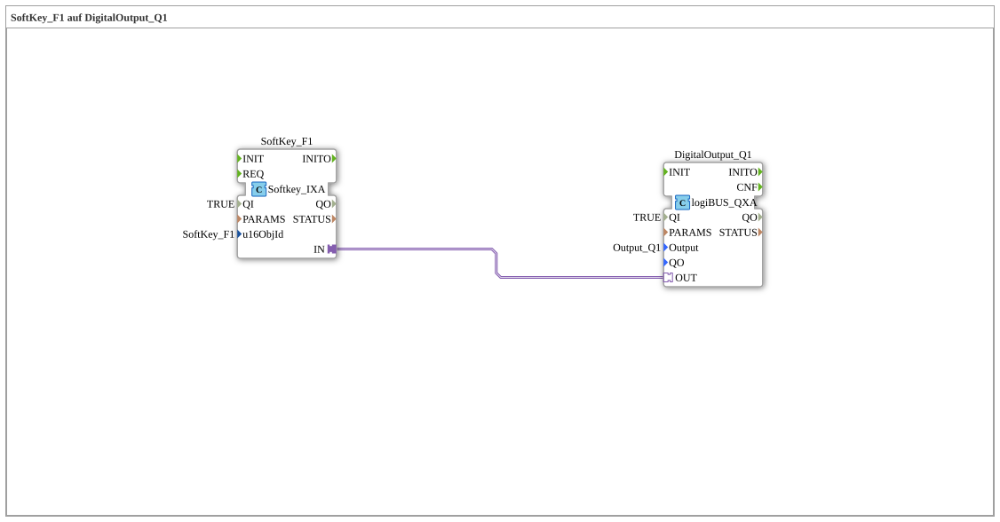

# Exercise_010_AX: SoftKey_F1 on DigitalOutput_Q1

This article describes the logiBUS® exercise `Uebung_010_AX`. Here, we enter the world of ISOBUS (ISO 11783). Instead of physical inputs, we use virtual keys on a terminal (Universal Terminal, UT).

## 🎧 Podcast

* [ISO 11783-6: Understanding Softkeys and the Virtual Terminal – Your Key to Agricultural Machinery Mechatronics ](https://podcasters.spotify.com/pod/show/isobus-vt-objects/episodes/ISO-11783-6-Softkeys-und-das-Virtual-Terminal-verstehen--Dein-Schlssel-zur-Landmaschinen-Mechatronik-e36a8b0)

----

## Objective of the Exercise

Using a `Softkey` block to control an output.

-----

## Description and Components

[cite_start]The subapplication `Uebung_010_AX.SUB` connects a softkey instance to a digital output[cite: 1].

### Function Blocks (FBs)

* **`SoftKey_F1`**: Type `isobus::UT::io::Softkey::Softkey_IXA`. This block represents the "F1" key on the ISOBUS terminal screen.

* **`DigitalOutput_Q1`**: The physical output.

### Parameters

* `u16ObjId`: References the object ID of the softkey in the object pool (here `SoftKey_F1`).

-----

## Functionality

The functionality is identical to a physical button. As long as the user keeps their finger on the touchscreen (or the button on the edge), the function block sends `TRUE`. When they release it, `FALSE` is sent.

-----

## Application Example

**Activating a machine function**: The operator presses the "work lights" icon on the screen, and the light turns on (as long as they hold the button down).