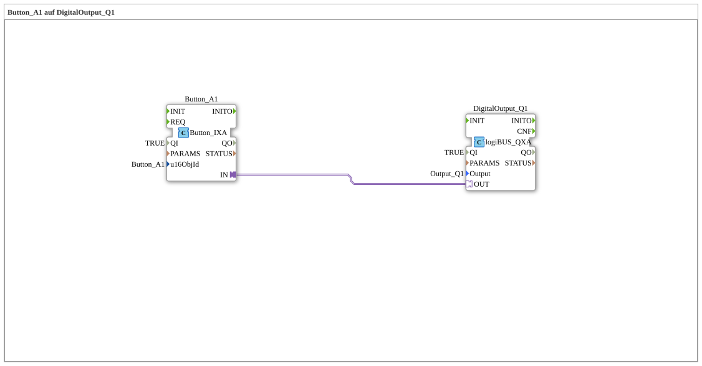

# Exercise_010a2_AX: Button_A1 on DigitalOutput_Q1

This article describes the logiBUS® exercise `Uebung_010a2_AX`. In addition to softkeys (F-keys), ISOBUS also uses buttons (switches in the data mask area).
----
## Objective of the exercise

Using `Button_IXA`.

-----

## Description and components

[cite_start]The subapplication `Uebung_010a2_AX.SUB` uses a button instead of a softkey[cite: 1].

### Function Blocks (FBs)

* **`Button_A1`**: Type `isobus::UT::io::Button::Button_IXA`. References `Button_A1`.

-----

## Functionality

Functionally identical to a softkey, but visually located in a different place on the terminal. A "button" is part of the workspace, a "softkey" is part of the fixed menu bar.