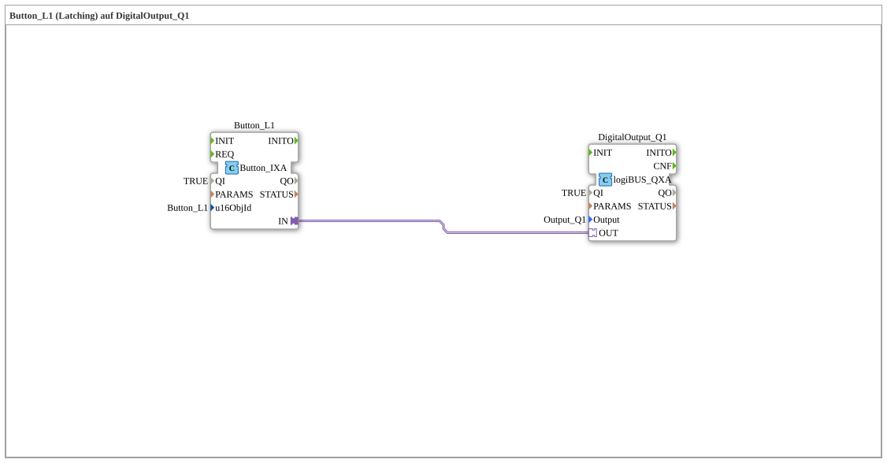

# Exercise_010a3_AX: Button_L1 (Latching) on DigitalOutput_Q1

This article describes the logiBUS® exercise `Uebung_010a3_AX`.

----

## Objective of the Exercise

Working with latching buttons.

-----

## Description and Components

[cite_start]The subapplication `Uebung_010a3_AX.SUB` uses `Button_L1`[cite: 1].

### Function Blocks (FBs)

* **`Button_L1`**: A button defined as "latching" in the ISOBUS pool.

-----

## Functionality

As commented in the code: *"Latching Button 'latches into place', no T_FF required!"*.

When the user presses this button, it changes its state (visually, e.g., pressed) and continuously sends `TRUE`. The next time it is pressed, it changes to `FALSE`. The memory behavior here is therefore handled by the **terminal**, not by the PLC logic.