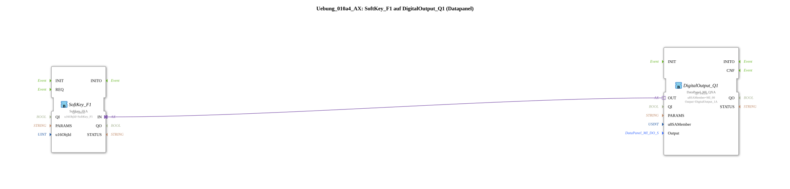

# Exercise_010a4_AX: SoftKey_F1 on DigitalOutput_Q1 (DataPanel)

This article describes the logiBUS® exercise `Uebung_010a4_AX`.
## 🎧 Podcast

* [ISO 11783-6: Understanding Softkeys and the Virtual Terminal – Your Key to Agricultural Machinery Mechatronics ](https://podcasters.spotify.com/pod/show/isobus-vt-objects/episodes/ISO-11783-6-Softkeys-und-das-Virtual-Terminal-verstehen--Dein-Schlssel-zur-Landmaschinen-Mechatronik-e36a8b0)

----

## Goal of the Exercise

Linking ISOBUS (UT) and hardware peripherals (DataPanel).

-----

## Description and Components

[cite_start]The subapplication `Uebung_010a4_AX.SUB` connects a softkey to an output of a DataPanel[cite: 1].

### Function Blocks (FBs)
* **`SoftKey_F1`**: Input via terminal.
* **`DigitalOutput_Q1`**: Type `DataPanel_MI_QXA`. Represents an output on an external CAN bus module (DataPanel).

-----

## Functionality

This demonstrates the transparency of logiBUS. The logic doesn't care whether the output is directly connected to the controller (`logiBUS_QXA`) or via CAN (`DataPanel_MI_QXA`). The adapter seamlessly connects both.
