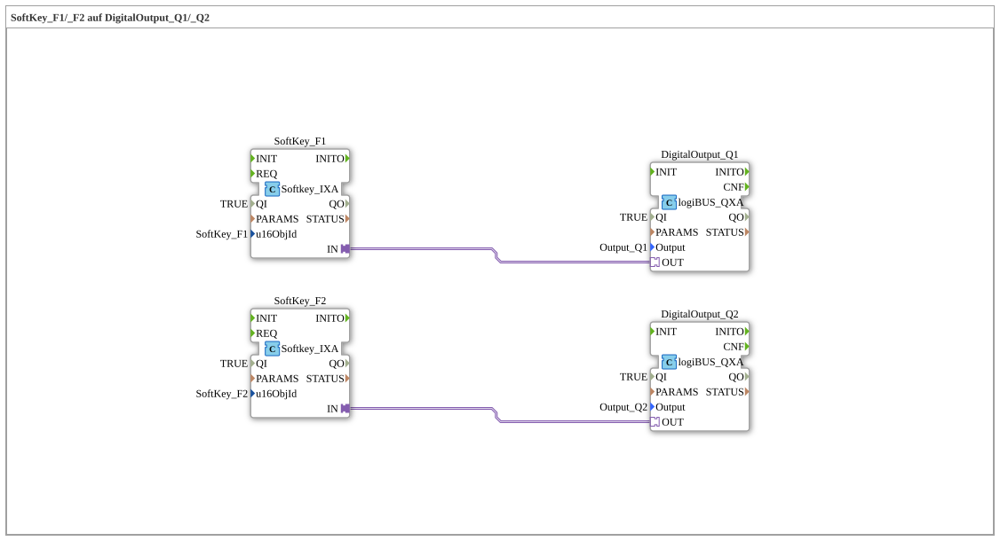

# Exercise_010a_AX: SoftKey_F1/_F2 on DigitalOutput_Q1/_Q2

This article describes the logiBUS® exercise `Uebung_010a_AX`.
## 🎧 Podcast

* [ISO 11783-6: Understanding Softkeys and the Virtual Terminal – Your Key to Agricultural Machinery Mechatronics ](https://podcasters.spotify.com/pod/show/isobus-vt-objects/episodes/ISO-11783-6-Softkeys-und-das-Virtual-Terminal-verstehen--Dein-Schlssel-zur-Landmaschinen-Mechatronik-e36a8b0)

----

## Objective of the Exercise

Extension to multiple softkeys.

-----

## Description and Components

[cite_start]The subapplication `Uebung_010a_AX.SUB` controls two outputs via two softkeys[cite: 1].

### Function Blocks (FBs)

* **`SoftKey_F1`** -> **`DigitalOutput_Q1`**
* **`SoftKey_F2`** -> **`DigitalOutput_Q2`**

-----

## Functionality

Two independent signal paths. This demonstrates that any number of softkeys can be instantiated, as long as they are defined in the object pool.
