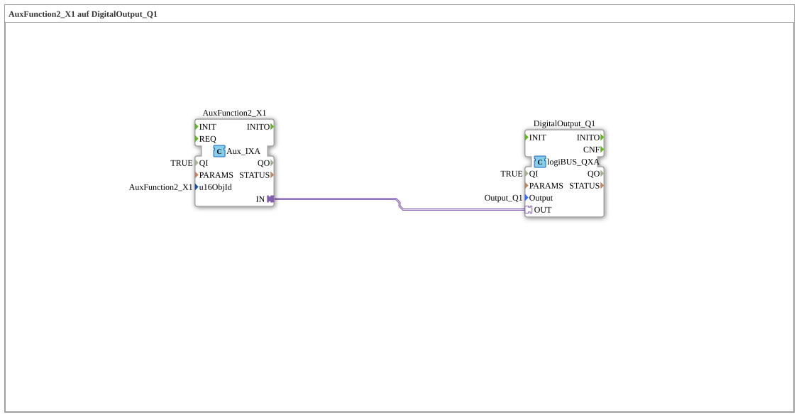

# Exercise_010b1_AX: AuxFunction2_X1 to DigitalOutput_Q1

This article describes the logiBUS® exercise `Uebung_010b1_AX`. Besides softkeys and buttons, AUX-N is the third important input method in ISOBUS.

----

## Objective of the Exercise

Processing Auxiliary Inputs (e.g., joystick buttons).

-----

## Description and Components

[cite_start]The subapplication `Uebung_010b1_AX.SUB` connects an AUX function to an output[cite: 1].

### Function Blocks (FBs)

* **`AuxFunction2_X1`**: Type `isobus::UT::io::Auxiliary::IN::Aux_IXA`. This block listens for ISOBUS AUX messages for the defined function.

-----

## Functionality

Unlike softkeys, which are fixed on the screen, an AUX function is abstract. The user must first assign a physical input (e.g., a button on the joystick) to this function ("Function 2") at the terminal (teaching).

Once the mapping is in place: Press the joystick button -> `Aux_IXA` becomes TRUE -> output is switched.