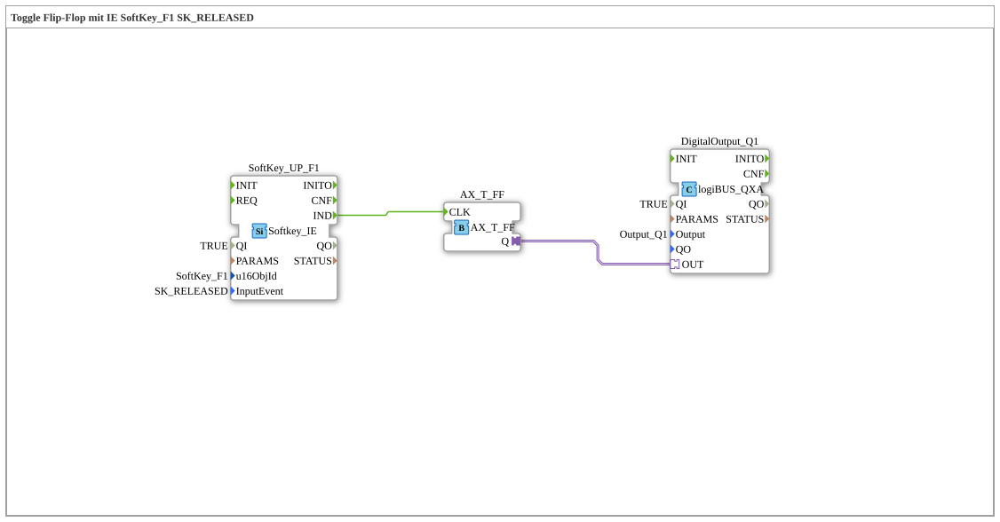

# Exercise_010b2_AX: Toggle Flip-Flop with IE SoftKey_F1 SK_RELEASED

This article describes the logiBUS® exercise `Uebung_010b2_AX`.
## 🎧 Podcast

* [ISO 11783-6: Understanding Softkeys and the Virtual Terminal – Your Key to Agricultural Machinery Mechatronics ](https://podcasters.spotify.com/pod/show/isobus-vt-objects/episodes/ISO-11783-6-Softkeys-und-das-Virtual-Terminal-verstehen--Dein-Schlssel-zur-Landmaschinen-Mechatronik-e36a8b0)

----

## Goal of the Exercise

Using `Softkey_IE` (Event) instead of `Softkey_IXA` (State).

-----

## Description and Components

[cite_start]The subapplication `Uebung_010b2_AX.SUB` uses a softkey to toggle a flip-flop[cite: 1].

### Function Blocks (FBs)

* **`SoftKey_UP_F1`**: Type `isobus::UT::io::Softkey::Softkey_IE`.
* **InputEvent**: `SK_RELEASED`.

-----

## Functionality

The event is triggered when the user **releases** the softkey. This is the standard behavior for "click" interactions (similar to a mouse). The flip-flop toggles its state each time it is released.
