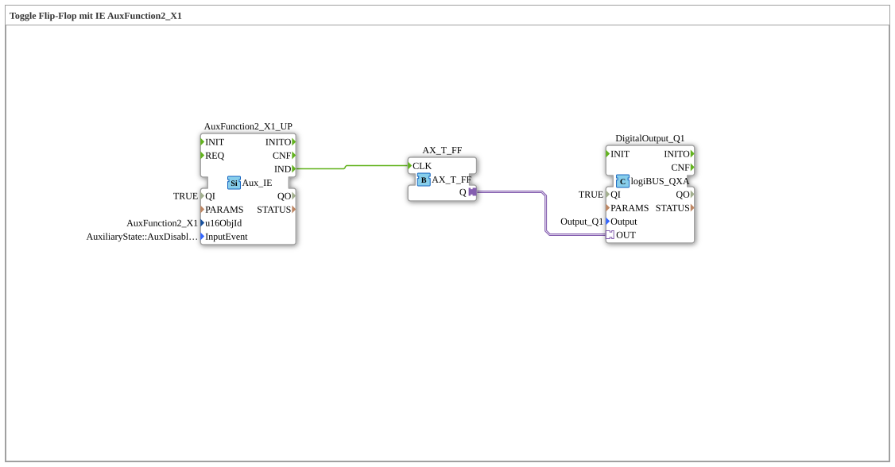

# Exercise_010b3_AX: Toggle Flip-Flop with IE AuxFunction2_X1

This article describes the logiBUS® exercise `Uebung_010b3_AX`.

----

## Objective of the Exercise

Using `Aux_IE` (Event).

-----

## Description and Components

[cite_start]The subapplication `Uebung_010b3_AX.SUB` toggles a flip-flop via AUX[cite: 1].

### Function Blocks (FBs)

* **`AuxFunction2_X1_UP`**: Type `isobus::UT::io::Auxiliary::IN::Aux_IE`. * **InputEvent**: `AuxDisabled_START`.

------

## Functionality

The event naming scheme for AUX is somewhat special:

* `AuxDisabled`: Means the switch is "Off" (Open).

* `AuxEnabled`: Means the switch is "On" (Closed).

* `_START`: Means edge (transition to this state).

`AuxDisabled_START` therefore means: The transition from "Enabled" to "Disabled". This corresponds to **releasing** a button (`Falling Edge`). The flip-flop thus switches when the joystick button is released.