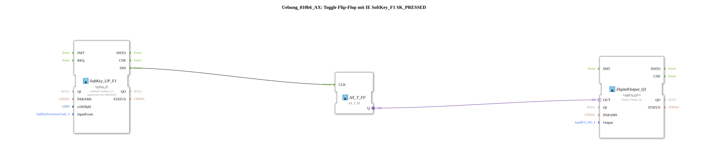

# Exercise_010b6_AX: Toggle Flip-Flop with IE SoftKey_F1 SK_PRESSED

[(https://notebooklm.google.com/notebook/041f4df4-b729-484d-b786-b6dcdf151961)
This article describes the logiBUS® exercise `Uebung_010b6_AX`.
## 🎧 Podcast

- [ISO 11783-6: Understanding Softkeys and the Virtual Terminal – Your Key to Agricultural Machinery Mechatronics ](https://podcasters.spotify.com/pod/show/isobus-vt-objects/episodes/ISO-11783-6-Softkeys-und-das-Virtual-Terminal-verstehen--Dein-Schlssel-zur-Landmaschinen-Mechatronik-e36a8b0)

----

## Exercise Goal

Reaction when pressed.

-----

## Description

[cite_start]Uses the event `SK_PRESSED`[cite: 1].

-----

## Functionality

The flip-flop switches the moment it is touched ("touch down"), not only when it is released. This feels "faster," but is unusual for touch interfaces (where you can usually drag the touch away to cancel).
