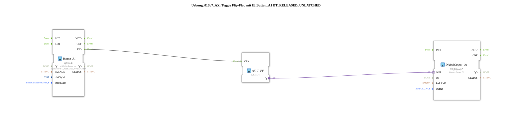

# Exercise_010b7_AX: Toggle Flip-Flop with IE Button_A1 BT_RELEASED_UNLATCHED

[(https://notebooklm.google.com/notebook/041f4df4-b729-484d-b786-b6dcdf151961)
This article describes the logiBUS® exercise `Uebung_010b7_AX`.
----
## Objective of the Exercise

Button events.

-----

## Description

[cite_start]Uses `Button_A1` with `BT_RELEASED_UNLATCHED`[cite: 1].

-----

## Functionality

Fires when a non-latching button is released. Equivalent to a normal click.

