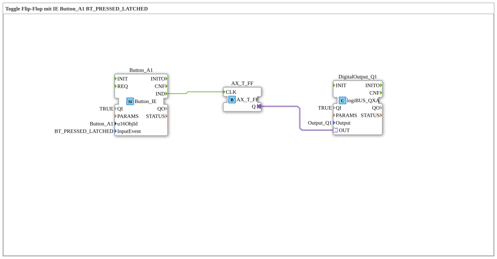

# Exercise_010b8_AX: Toggle Flip-Flop with IE Button_A1 BT_PRESSED_LATCHED

[(https://notebooklm.google.com/notebook/041f4df4-b729-484d-b786-b6dcdf151961)
This article describes the logiBUS® exercise `Uebung_010b8_AX`.
----
## Purpose of the Exercise

Events for latching buttons.

-----

## Description

[cite_start]Uses `Button_A1` with `BT_PRESSED_LATCHED`[cite: 1].

-----

## Functionality

This is intended for buttons that should visually latch. The event occurs when the button enters the "pressed/latched" state.

