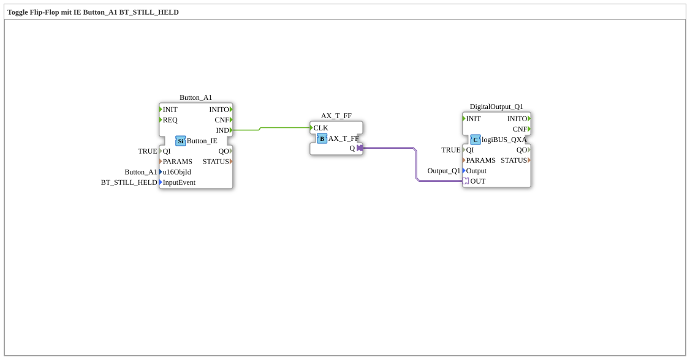

# Exercise_010b9_AX: Toggle Flip-Flop with IE Button_A1 BT_STILL_HELD

[(https://notebooklm.google.com/notebook/041f4df4-b729-484d-b786-b6dcdf151961)
This article describes the logiBUS® exercise `Uebung_010b9_AX`.
----
## Purpose of the Exercise

Repeating events.

----

## Description

[cite_start]Utilizes `Button_A1` with `BT_STILL_HELD`[cite: 1].

-----

## Functionality

As described in the comment: *"BT_STILL_HELD is repeated every 200ms."*

If the user holds down the button, the function block fires an event every 200ms. Since this is connected to a toggle flip-flop, the output (`Q1`) blinks every 200ms (period 400ms) as long as the button is pressed.