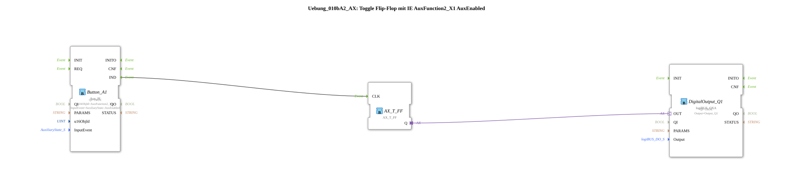

# Exercise_010bA2_AX: Toggle Flip-Flop with IE AuxFunction2_X1 AuxEnabled

This article describes the logiBUS® exercise `Uebung_010bA2_AX`. It covers the finer points of the AUX specification.

----

## Objective of the Exercise

Behavior of `AuxEnabled`.

-----

## Description

[cite_start]Uses `AuxFunction2_X1` with `AuxEnabled`[cite: 1].

-----

## Functionality

The comment explains the difference depending on the AUX type (Bool_Latched=0 vs Bool_NonLatched=2).

For a **Type 2 (Non-Latched)** (e.g., a joystick button), `AuxEnabled` is sent **once** when pressed.

For a **Type 0 (Latched)** (e.g., a toggle switch), `AuxEnabled` is **repeated cyclically** as long as it is activated.

Since Type 2 is assumed here, it behaves like a normal click.