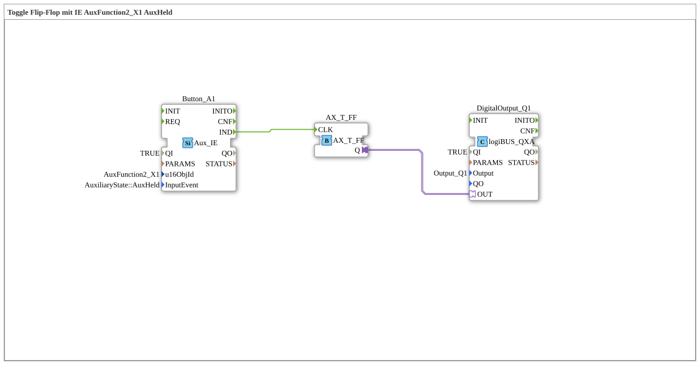

# Exercise_010bA3_AX: Toggle Flip-Flop with IE AuxFunction2_X1 AuxHeld

This article describes the logiBUS® exercise `Uebung_010bA3_AX`.
----
## Objective of the Exercise

Behavior of `AuxHeld`.

-----

## Description

[cite_start]Uses `AuxFunction2_X1` with `AuxHeld`[cite: 1].

-----

## Functionality

Comment: *"AuxHeld is repeated with an AUX Type 2. This results in a blinking effect."*
Similar to `BT_STILL_HELD`: As long as the joystick button is held down, events occur, and the flip-flop blinks.