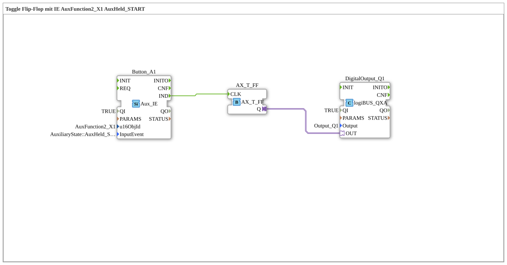

# Exercise_010bA4_AX: Toggle Flip-Flop with IE AuxFunction2_X1 AuxHeld_START

[(https://notebooklm.google.com/notebook/041f4df4-b729-484d-b786-b6dcdf151961)
This article describes the logiBUS® exercise `Uebung_010bA4_AX`
----

## Purpose of the Exercise

Behavior of `AuxHeld_START`.

-----

## Description

[cite_start]Uses `AuxFunction2_X1` with `AuxHeld_START`[cite: 1].

-----

## Functionality

Comment: *"AuxHeld_START is only sent once. Regardless of the type."*
This is the correct event for "Long Press" in AUX.
