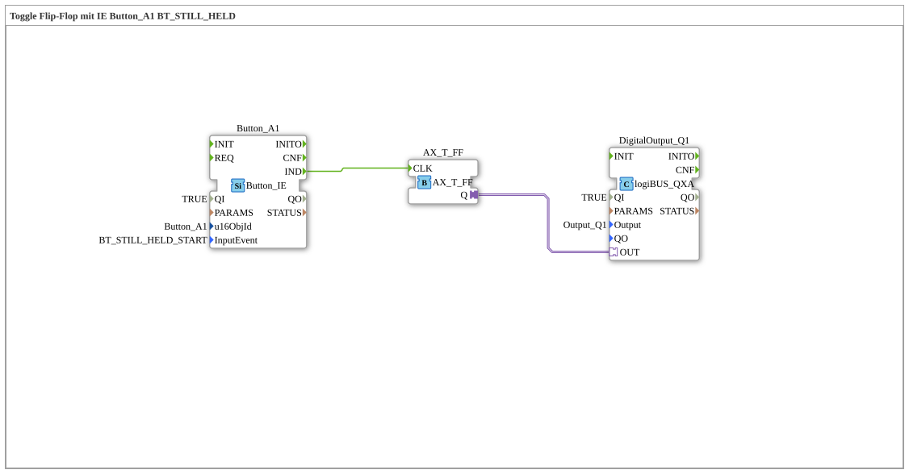

# Exercise_010bA_AX: Toggle Flip-Flop with IE Button_A1 BT_STILL_HELD

[(https://notebooklm.google.com/notebook/041f4df4-b729-484d-b786-b6dcdf151961)
This article describes the logiBUS® exercise `Uebung_010bA_AX`.
----
## Purpose of the exercise

Difference to `STILL_HELD`.

-----

## Description

[cite_start]Uses `Button_A1` with `BT_STILL_HELD_START`[cite: 1].

-----

## Functionality

Comment: *"BT_STILL_HELD_START is not repeated. Long press results in 1 event."*
This corresponds to a "Long Press" event for ISOBUS buttons. It fires exactly once when the "held" threshold is exceeded.