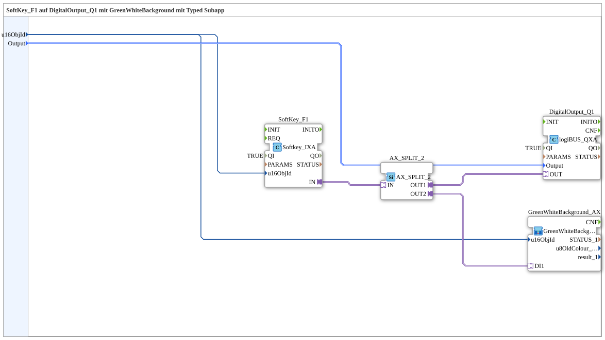

Here is the documentation for the exercise based on the provided XML content.

# Exercise_010c3_sub_AX: SoftKey_F1 on DigitalOutput_Q1 with GreenWhiteBackground using a Typed Subapp



*(Insert placeholder for an image of the exercise here)*

* * * * * * * * * *

## Introduction
This exercise demonstrates the creation and use of a "Typed SubApp". The logic connects a softkey input (F1) on an ISOBUS terminal to a physical digital output (Q1) and visual feedback (background color). Encapsulating the code in a subapp makes it modular and reusable.

## Function Blocks (FBs) Used

In this subapp, various function blocks and another subapp are interconnected to achieve the desired functionality.

### Sub-Blocks: Exercise_010c3_sub_AX (This component itself)

* **Type**: SubAppType
* **Interface**:

* **Inputs**:

* `u16ObjId` (UINT): The object ID for the ISOBUS element.

* `Output` (logiBUS_DO_S): Identifies the physical output (e.g., Q1..Q8).

* **Internal Function Blocks Used**:

* **SoftKey_F1**: `isobus::UT::io::Softkey::Softkey_IXA`

* **Parameters**:

* `QI` = `TRUE`

* **Event Output/Input**: Adapter connection via port `IN`.


* * **Data Input**: `u16ObjId` (comes from the SubApp interface).

* **Description**: This function block represents the F1 soft key on the Universal Terminal (UT).

* **Digital Output_Q1**: `logiBUS::io::DQ::logiBUS_QXA`

* **Parameters**:

* `QI` = `TRUE`

* `PARAMS` = (Visible: false)

* **Event Output/Input**: Adapter connection via port `OUT`.

* **Data Input**: `Output` (comes from the SubApp interface).

* **Description**: Controls a hardware-based digital output via the logiBUS.


* **AX_SPLIT_2**: `adapter::events::unidirectional::AX_SPLIT_2`

* **Functionality**: A splitter module for adapter connections. It receives an adapter signal (`IN`) and splits it to two outputs (`OUT1`, `OUT2`) to control multiple destinations simultaneously.

* **GreenWhiteBackground_AX**: `MyLib::sys::GreenWhiteBackground_AX`

* **Type**: Nested SubApp

* **Connections**:

* Data input `u16ObjId` connected to the interface.

* Adapter input `DI1` connected to `AX_SPLIT_2.OUT2`.

* * **Description**: Another encapsulated logic module responsible for switching the background color (green/white).

## Program Flow and Connections

The flow within this sub-app is as follows:

1. **Initialization**: The IDs for the ISOBUS object and the hardware output to be switched are passed to the internal modules via the sub-app's inputs (`u16ObjId` and `Output`).

2. **Input (SoftKey)**: Module `SoftKey_F1` monitors the terminal's F1 key. When this key is pressed, a signal is sent via the adapter port `IN`.

3. **Signal Distribution**: The signal from the softkey is routed to module `AX_SPLIT_2`. This splits the signal into two paths:

* **Path 1 (Hardware)**: Goes to `DigitalOutput_Q1`. This switches the physical output (corresponding to the input parameter `Output`).

* **Path 2 (Visualization)**: Goes to the subapp `GreenWhiteBackground_AX`. This likely changes the background color of the associated object to provide visual feedback to the user.

**Learning Objectives:**

* Understanding adapter connections and their splitting.

* Working with nested subapps (subapp within subapp).

* Linking ISOBUS UI elements to hardware I/Os.

**Prerequisites:**

* Basic knowledge of IEC 61499.

* Understanding the adapter concept in 4diac.

## Summary
The exercise `Uebung_010c3_sub_AX` is a reusable module that maps a softkey operation to both a hardware output and a display visualization. Using the `AX_SPLIT_2` module, it demonstrates how a single adapter event can be processed in parallel to keep hardware actions and UI updates synchronized.

---

### 🌐 Related topic subpages on ms-muc-docs.de

* [🌐 Eclipse 4diac IDE & color reference on ms-muc-docs.de ](https://www.ms-muc-docs.de/iec-61499/eclipse-4diac/)


```