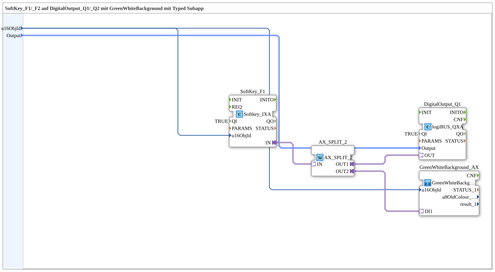

Here is the documentation for exercise `Uebung_010c4_sub_AX` based on the provided XML content.

# Exercise_010c4_sub_AX: SoftKey_F1/_F2 on DigitalOutput_Q1/_Q2 with GreenWhiteBackground using a Typed Subapp



*(Placeholder for an image of the exercise, if available)*

* * * * * * * * * *

## Introduction
This exercise covers the creation of a typed sub-application (`SubAppType`). The goal of this function block is to link an ISOBUS soft key (SoftKey) to a digital output (DigitalOutput) and simultaneously implement visual feedback via a background controller. The function block encapsulates this logic to make it reusable (e.g., for F1/Q1, F2/Q2, etc.).


## Function Blocks Used (FBs)

This network uses various specialized function blocks to control communication between user input (softkey) and hardware output (digital output).

### Main Function Blocks
The following function blocks are directly connected in the network:

* **SoftKey_F1** (`isobus::UT::io::Softkey::Softkey_IXA`):

* Serves as the input interface for a softkey on the Universal Terminal (UT).

* Parameter `QI` is set to `TRUE`.

* **DigitalOutput_Q1** (`logiBUS::io::DQ::logiBUS_QXA`):

* Represents the physical digital output.

* Parameter `QI` is set to `TRUE`.

* **AX_SPLIT_2** (`adapter::events::unidirectional::AX_SPLIT_2`):

* An adapter block that splits an incoming signal to forward it to two different destinations (splitter).

### Sub-Blocks: GreenWhiteBackground_AX
Within this exercise, another sub-application will be instantiated.

- **Type**: `MyLib::sys::GreenWhiteBackground_AX`
- **Internal Function Blocks Used**:

* *Note: The internal structure of this sub-block is not included in the provided XML. Based on the interconnection in the higher-level network, the following interface usage can be derived:*

- **Event Output/Input**:

- Input `DI1`: Connected to the splitter output `OUT2`.

- **Data Output/Input**:

- Input `u16ObjId`: Connected to the input variable `u16ObjId`.

- **Functionality**:

This sub-module likely controls the visual display (green/white background) on the terminal, based on the softkey status.

## Program Flow and Connections

The flow within `Uebung_010c4_sub_AX` is controlled by adapter and data connections:

1. **Data Flow (Initialization):**

* The object ID (`u16ObjId`) is passed from the sub-application's interface to `SoftKey_F1` and `GreenWhiteBackground_AX`. This defines which GUI object is addressed.


``` * The variable `Output` is passed to `DigitalOutput_Q1` to address the correct physical output.

2. **Signal Flow (Runtime):**

* When the **SoftKey_F1** is pressed, it sends a signal via its adapter connection `IN`.

* This signal goes to the splitter chip **AX_SPLIT_2**.

* The splitter splits the signal into two paths:

* **Path 1 (`OUT1`):** Goes to `DigitalOutput_Q1.OUT`. This switches the digital output.

* **Path 2 (`OUT2`):** Goes to `GreenWhiteBackground_AX.DI1`. This triggers a change in the background color (visual feedback).

This structure ensures that the hardware circuitry and visual feedback are synchronized with the button press.

## Summary
The `Uebung_010c4_sub_AX` is a modular component for connecting a soft key to a digital output and visual feedback. The signal distribution is efficiently managed through the use of adapters (`AX_SPLIT_2`), while the data connections provide the necessary configuration (IDs).