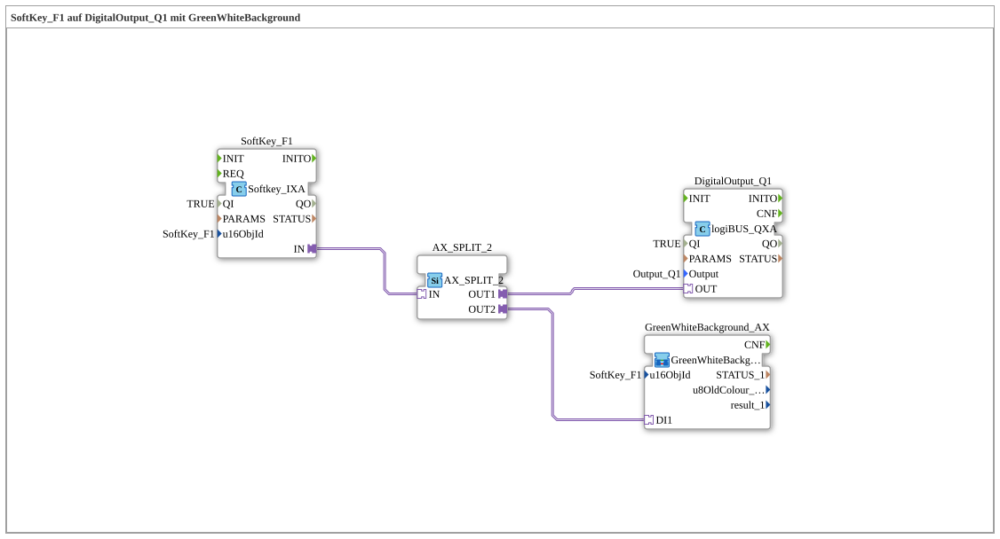

# Exercise_010c_AX: SoftKey_F1 on DigitalOutput_Q1 with GreenWhiteBackground

[(https://notebooklm.google.com/notebook/041f4df4-b729-484d-b786-b6dcdf151961)
This article describes the logiBUS® exercise `Uebung_010c_AX`. So far, the keys have only switched inputs. Now they should also light up.
## 🎧 Podcast

- [ISO 11783-6: Understanding Softkeys and the Virtual Terminal – Your Key to Agricultural Machinery Mechatronics ](https://podcasters.spotify.com/pod/show/isobus-vt-objects/episodes/ISO-11783-6-Softkeys-und-das-Virtual-Terminal-verstehen--Dein-Schlssel-zur-Landmaschinen-Mechatronik-e36a8b0)

----

## Goal of the Exercise

Feedback to the operator (color change).

-----

## Description and Components

[cite_start]The subapplication `Uebung_010c_AX.SUB` extends the simple softkey circuit with a feedback block[cite: 1].

### Function Blocks (FBs)

- **`SoftKey_F1`**: Input.
- **`DigitalOutput_Q1`**: Output (lamp).
- **`GreenWhiteBackground_AX`**: A subapplication from the library `MyLib::sys`. This controls the appearance of the softkey on the terminal (green = active, white = inactive).
- **`AX_SPLIT_2`**: Distributes the signal from the softkey to both the output `Q1` and the feedback block.

-----

## Functionality

When the user presses the button, the signal becomes valid.

1. The physical output is activated.
2. Simultaneously, the input `DI1` of the feedback sub-app `TRUE` is activated. This sends an ISOBUS command to the terminal to change the background of the softkey `F1` to green.
3. When the button is released, the output is deactivated and the softkey returns to white.

This provides the user with direct visual feedback on the touchscreen.
