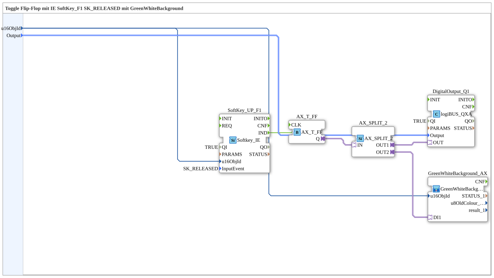

# Exercise_010d2_sub_AX: Toggle flip-flop with SoftKey_F1 and GreenWhiteBackground using a Typed Subapp

* * * * * * * * * *

## Introduction

This exercise demonstrates the creation and use of a "Typed SubApp" for a toggle flip-flop circuit. The logic connects a softkey input (F1) to a toggle flip-flop that switches a physical digital output (Q1) as well as a visual feedback (background color). Encapsulating the logic in a SubApp makes the code modular and reusable.

## Function blocks (FBs) used

### Sub-blocks: Uebung_010d2_sub_AX (this component itself)

-   **Type**: SubAppType
-   **Interface**:
    -   **Inputs**:
        -   `u16ObjId` (UINT): The object ID for the ISOBUS element.
        -   `Output` (logiBUS_DO_S): Identifies the physical output (e.g. Q1..Q8).
-   **Internal FBs used**:

    -   **SoftKey_UP_F1**: `isobus::UT::io::Softkey::Softkey_IE`
        -   **Parameters**:
            -   `QI` = `TRUE`
            -   `InputEvent` = `SK_RELEASED`
        -   **Event output**: `IND`, triggered when the key is released.
        -   **Data input**: `u16ObjId` (from the SubApp interface).
        -   **Description**: This block represents softkey F1 on the Universal Terminal (UT), but only reacts on release.

    -   **AX_T_FF**: `adapter::events::unidirectional::AX_T_FF`
        -   **Functionality**: Toggle flip-flop. Every event on `CLK` inverts the adapter output `Q`.
        -   **Event input**: `CLK`, connected to `SoftKey_UP_F1.IND`.

    -   **AX_SPLIT_2**: `adapter::events::unidirectional::AX_SPLIT_2`
        -   **Functionality**: A splitter block for adapter connections. It takes the state signal from `AX_T_FF.Q` and splits it into two outputs (`OUT1`, `OUT2`) to drive multiple targets at once.

    -   **DigitalOutput_Q1**: `logiBUS::io::DQ::logiBUS_QXA`
        -   **Parameters**:
            -   `QI` = `TRUE`
        -   **Event input**: Adapter connection via port `OUT`.
        -   **Data input**: `Output` (from the SubApp interface).
        -   **Description**: Drives a hardware-side digital output via the logiBUS.

    -   **GreenWhiteBackground_AX**: `MyLib::sys::GreenWhiteBackground1_AX`
        -   **Type**: Nested SubApp
        -   **Connections**:
            -   Data input `u16ObjId` connected to the interface.
            -   Adapter input `DI1` connected to `AX_SPLIT_2.OUT2`.
        -   **Description**: Additional encapsulated logic responsible for switching the background color (green/white).

## Program flow and connections

The flow within this SubApp is as follows:

1.  **Initialization**: Via the SubApp's inputs (`u16ObjId` and `Output`), the IDs for the ISOBUS object and the hardware output to be switched are passed to the internal blocks.
2.  **Input (softkey)**: The block `SoftKey_UP_F1` monitors terminal key F1. When released, it sends a signal via the `IND` event.
3.  **Toggle**: The event reaches `AX_T_FF.CLK`, inverting the internal state `Q`.
4.  **Signal distribution**: The adapter signal `AX_T_FF.Q` reaches `AX_SPLIT_2`, which splits it into two paths:
    -   **Path 1 (hardware)**: Goes to `DigitalOutput_Q1`, switching the physical output (per the `Output` input parameter).
    -   **Path 2 (visualization)**: Goes to the SubApp `GreenWhiteBackground_AX`, which changes the background color of the associated softkey to give the user visual feedback.

**Learning objectives:**

-   Understanding toggle flip-flops (`AX_T_FF`) compared to direct pass-through.
-   Working with adapter connections and their splitting.
-   Working with nested SubApps (SubApp inside a SubApp).
-   Linking ISOBUS UI elements with hardware I/Os.

**Prerequisites:**

-   Basic knowledge of IEC 61499.
-   Understanding of the adapter concept in 4diac.
-   Familiarity with exercise `Uebung_010c3_sub_AX` (direct pass-through without toggle).

## Summary

Exercise `Uebung_010d2_sub_AX` is a reusable module that maps a softkey control via a toggle flip-flop onto both a hardware output and a display visualization. The use of the `AX_SPLIT_2` block demonstrates how a single adapter event can be processed in parallel to keep hardware actions and UI updates in sync.

---

### 🌐 Related topic subpages on ms-muc-docs.de

- [🌐 Eclipse 4diac IDE & Color Reference on ms-muc-docs.de](https://www.ms-muc-docs.de/iec-61499/eclipse-4diac/)
