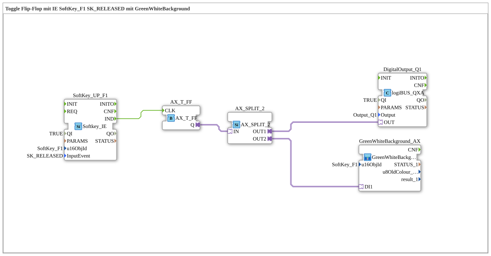

# Exercise_010d_AX: Toggle flip-flop with SoftKey_F1 and GreenWhiteBackground

This article describes the logiBUS® exercise `Uebung_010d_AX`.

----

## Goal of the exercise

Instead of just switching through directly, SoftKey `F1` should now toggle a state every time the key is released.

-----

## Description and components

The subapplication `Uebung_010d_AX.SUB` replaces the direct pass-through from `Uebung_010c_AX` with a toggle flip-flop.

### Function blocks (FBs)

  - **`SoftKey_UP_F1`**: `isobus::UT::io::Softkey::Softkey_IE`, triggered by the `SK_RELEASED` event (reacts only when the key is released, not when pressed).
  - **`AX_T_FF`**: Toggle flip-flop adapter. Every clock event on `CLK` inverts the output state `Q`.
  - **`AX_SPLIT_2`**: Distributes the adapter signal from `AX_T_FF.Q` to both output `Q1` and the feedback block.
  - **`DigitalOutput_Q1`**: Output (lamp), `Output_Q1`.
  - **`GreenWhiteBackground_AX`**: SubApp from `MyLib::sys`, controls the appearance of softkey `F1` on the terminal (green = active, white = inactive).

-----

## How it works

1.  The user releases softkey `F1`; `SoftKey_UP_F1` triggers the `IND` event.
2.  `AX_T_FF` inverts its internal state `Q` (ON becomes OFF, OFF becomes ON).
3.  `AX_SPLIT_2` distributes the new state to `DigitalOutput_Q1` (physical output) and `GreenWhiteBackground_AX` (softkey background color).

Unlike `Uebung_010c_AX`, where the output is only active while the key is pressed, the state here persists until the key is released again.
