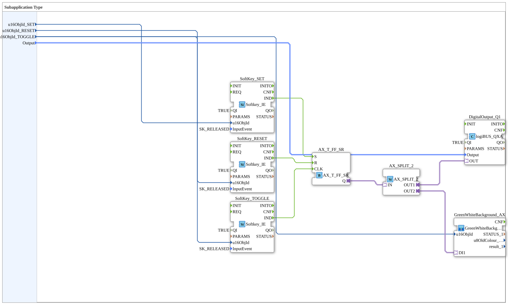

# Exercise_010e2_sub_AX: SR+Toggle flip-flop with 3x SoftKey and GreenWhiteBackground using a Typed Subapp

* * * * * * * * * *

## Introduction

This exercise demonstrates the creation and use of a "Typed SubApp" for an SR+toggle flip-flop with three softkeys. The logic connects three softkey inputs (Set, Reset, Toggle) to a combined memory block that drives a physical digital output (Q1) as well as visual feedback (background color on the toggle softkey). Encapsulating the logic in a SubApp makes the code modular and reusable.

## Function blocks (FBs) used

### Sub-blocks: Uebung_010e2_sub_AX (this component itself)

-   **Type**: SubAppType
-   **Interface**:
    -   **Inputs**:
        -   `u16ObjId_SET` (UINT): Object ID of the Set softkey.
        -   `u16ObjId_RESET` (UINT): Object ID of the Reset softkey.
        -   `u16ObjId_TOGGLE` (UINT): Object ID of the Toggle softkey (also used for the background color).
        -   `Output` (logiBUS_DO_S): Identifies the physical output (e.g. Q1..Q8).
-   **Internal FBs used**:

    -   **SoftKey_SET**, **SoftKey_RESET**, **SoftKey_TOGGLE**: each `isobus::UT::io::Softkey::Softkey_IE`
        -   **Parameters**: `QI` = `TRUE`, `InputEvent` = `SK_RELEASED`
        -   **Event output**: `IND`, triggered when the respective key is released.
        -   **Data input**: `u16ObjId` from the corresponding SubApp input variable.

    -   **AX_T_FF_SR**: `adapter::events::unidirectional::AX_T_FF_SR`
        -   **Functionality**: Combined SR+toggle flip-flop. `S` sets the output `Q`, `R` resets it, `CLK` inverts it.
        -   **Event inputs**: `S` ← `SoftKey_SET.IND`, `R` ← `SoftKey_RESET.IND`, `CLK` ← `SoftKey_TOGGLE.IND`.

    -   **AX_SPLIT_2**: `adapter::events::unidirectional::AX_SPLIT_2`
        -   **Functionality**: A splitter block for adapter connections. It takes the state signal from `AX_T_FF_SR.Q` and splits it into two outputs (`OUT1`, `OUT2`).

    -   **DigitalOutput_Q1**: `logiBUS::io::DQ::logiBUS_QXA`
        -   **Parameters**: `QI` = `TRUE`
        -   **Data input**: `Output` (from the SubApp interface).
        -   **Description**: Drives a hardware-side digital output via the logiBUS.

    -   **GreenWhiteBackground_AX**: `MyLib::sys::GreenWhiteBackground1_AX`
        -   **Type**: Nested SubApp
        -   **Connections**:
            -   Data input `u16ObjId` connected to `u16ObjId_TOGGLE` (only the toggle softkey shows the feedback).
            -   Adapter input `DI1` connected to `AX_SPLIT_2.OUT2`.

## Program flow and connections

1.  **Initialization**: Via the SubApp's inputs, the object IDs of the three softkeys and the hardware output to be switched are passed to the internal blocks.
2.  **Set**: When `SoftKey_SET` is released, `AX_T_FF_SR.S` sets the state `Q` to ON.
3.  **Reset**: When `SoftKey_RESET` is released, `AX_T_FF_SR.R` sets the state `Q` to OFF.
4.  **Toggle**: When `SoftKey_TOGGLE` is released, `AX_T_FF_SR.CLK` inverts the current state `Q`.
5.  **Signal distribution**: `AX_SPLIT_2` distributes the new state to `DigitalOutput_Q1` (physical output) and `GreenWhiteBackground_AX` (background color of the toggle softkey).

**Learning objectives:**

-   Understanding combined SR+toggle flip-flops (`AX_T_FF_SR`) with multiple independent event inputs.
-   Working with adapter connections and their splitting.
-   Working with nested SubApps (SubApp inside a SubApp).
-   Linking multiple ISOBUS UI elements to a shared memory state.

**Prerequisites:**

-   Basic knowledge of IEC 61499.
-   Understanding of the adapter concept in 4diac.
-   Familiarity with exercises `Uebung_010c3_sub_AX` and `Uebung_010d2_sub_AX`.

## Summary

Exercise `Uebung_010e2_sub_AX` is a reusable module that maps three independent softkey inputs (Set, Reset, Toggle) onto a shared memory state and transfers it to both a hardware output and a display visualization.

---

### 🌐 Related topic subpages on ms-muc-docs.de

- [🌐 Eclipse 4diac IDE & Color Reference on ms-muc-docs.de](https://www.ms-muc-docs.de/iec-61499/eclipse-4diac/)
