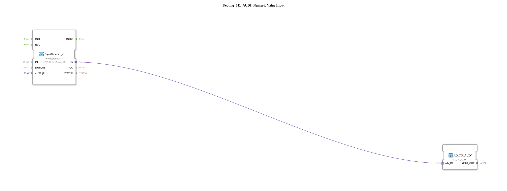

# Exercise_011_AUDI: Numeric Value Input

This article describes the logiBUS® exercise `Uebung_011_AUDI`. It is the adapter-based version of exercise 011 and demonstrates how numeric values can be processed efficiently and clearly.
----
## Objective of the Exercise

To learn modern, adapter-based processing of ISOBUS terminal inputs. Using adapters makes the block network more compact, and the separation of event and data flow is implicit within the adapter structure.
-----

## Description and Components

The subapplication `Uebung_011_AUDI.SUB` uses an adapter-based input block.

## Function Blocks (FBs)

* **`InputNumber_I1`**: Type `NumericValue_IDA`. This function block represents a numeric input field on the ISOBUS terminal. Unlike the standard version (`_ID`), this function block uses an AX-based adapter output (`IN`) that combines both the event and the DWORD value.
* **`F_DWORD_TO_UDINT`**: This uses the new function block type `AD_TO_AUDI`. It receives the `AD` adapter and outputs a `AUDI` adapter, which carries the value as `UDINT`.

-----

## Functionality

The connection between input and conversion is made exclusively via an adapter line:

<AdapterConnections>
<Connection Source="InputNumber_I1.IN" Destination="F_DWORD_TO_UDINT.AD_IN"/>
</AdapterConnections>
1. The user enters a value at the terminal (e.g., "100").
2. After confirmation, the `InputNumber_I1` module sends the update via the adapter plug.
3. The converter `AD_TO_AUDI` (instantiated as `F_DWORD_TO_UDINT`) receives this packet, converts its type, and makes the result available to the `AUDI` plug for the remaining logic.

-----

## Conclusion

This exercise illustrates the advantage of adapters: Instead of having to draw separate lines for events (`REQ`/`CNF`) and data (`IN`/`OUT`), a single adapter connection is sufficient. This significantly reduces the potential for errors and improves the program's readability.
