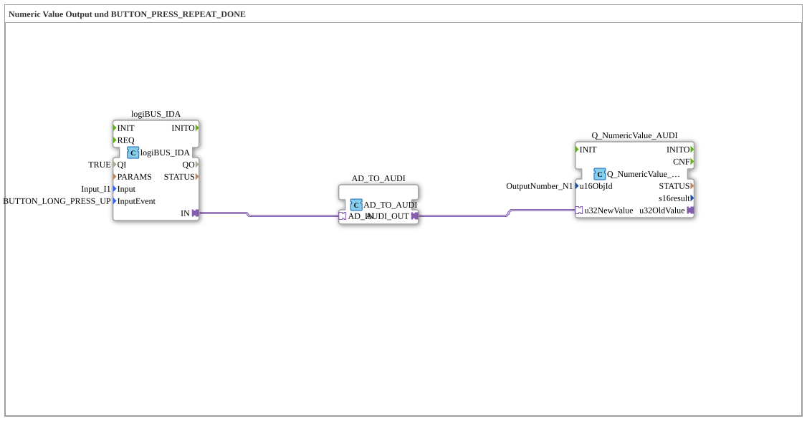

# Exercise_011a2_AUDI: Numeric Value Output and BUTTON_PRESS_REPEAT_DONE

* * * * * * * * * *
## Introduction
This exercise demonstrates the output of a numeric value using a button press event (BUTTON_LONG_PRESS_UP). A digital input block (logiBUS_IDA) is used, which triggers an event when the button is pressed and held. This event is converted via an adapter into a format that the output block Q_NumericValue_AUDI can process – this then outputs the predefined numeric value on the ISOBUS.
## Function Blocks (FBs) Used
- **logiBUS_IDA**
- **Type**: logiBUS::io::DI::logiBUS_IDA
- **Parameters**: QI = TRUE, Input = Input_I1, InputEvent = BUTTON_LONG_PRESS_UP
- **Functionality**: Represents a digital input that reacts to the "long press" event. When triggered, a corresponding signal is passed to the adapter.
- **AD_TO_AUDI**
- **Type**: adapter::conversion::unidirectional::AD_TO_AUDI
- **Functionality**: Serves as an adapter for the unidirectional conversion of logiBUS ADA data into the format expected by the numeric output block (Q_NumericValue_AUDI). It converts the event into a data value.
- **Q_NumericValue_AUDI**
- **Type**: isobus::UT::Q::Q_NumericValue_AUDI
- **Parameter**: u16ObjId = OutputNumber_N1
- **Functionality**: Receives a 32-bit value (here via the adapter) and outputs it via the ISOBUS object with the object ID `OutputNumber_N1`. This enables the display of a numeric value on an ISOBUS terminal.

**Type**: u16ObjId = OutputNumber_N1
**Function**: Receives a 32-bit value (here via the adapter) and outputs it via the ISOBUS object with the object ID `OutputNumber_N1`.** This allows the display of a numeric value on an ISOBUS terminal. ## Program Flow and Connections

The function blocks are connected as follows:

1. **logiBUS_IDA** -> **AD_TO_AUDI (AD_IN)**:

When a key is pressed for an extended period (event `BUTTON_LONG_PRESS_UP`), `logiBUS_IDA` generates a signal at output `IN`, which is forwarded to the adapter input `AD_IN`.

2. **AD_TO_AUDI (AUDI_OUT)** -> **Q_NumericValue_AUDI (u32NewValue)**:

The adapter converts the incoming signal into a numeric data value and sends it via output `AUDI_OUT` to the data input `u32NewValue` of the output block.

This chain outputs the defined numerical value (here, the ISOBUS object `OutputNumber_N1`) with each long press of a key.

**Learning Objectives**:

- Using digital input blocks with event triggering (long press).
- Using adapters to convert between different protocol/data formats.
- Outputting numerical values via ISOBUS objects.

**Difficulty Level**: Beginner / Basic
**Required Prior Knowledge**: Basic understanding of function blocks, events, and ISOBUS communication.

## Summary
The exercise **Exercise_011a2_AUDI** demonstrates a compact process: A long press of a digital key triggers an event chain, at the end of which a numerical value is output on the ISOBUS. The three components used—the input block, a conversion adapter, and the output block—are loosely coupled via adapter connections. This enables flexible, event-driven value output and conveys basic concepts of modular control programming.