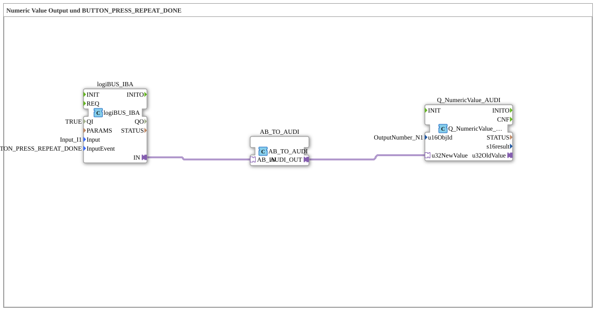

# Exercise_011a_AUDI: Numeric Value Output and BUTTON_PRESS_REPEAT_DONE

* * * * * * * * * *
## Introduction
This exercise demonstrates the use of a digital input (pushbutton) with repeat detection (`BUTTON_PRESS_REPEAT_DONE`) to output a numeric value to an ISOBUS Virtual Terminal.
The incoming button press is captured via a logiBUS IBA interface, converted into an ISOBUS-compatible format via an adapter, and finally sent to a `Q_NumericValue_AUDI` block, which displays the value on the terminal's screen.

This exercise is based on the IEC 61499 standard and uses the predefined libraries `logiBUS` and `isobus`. It is suitable for beginners to the 4diac IDE who want to familiarize themselves with linking physical inputs and ISOBUS VT components.
...
## Function Blocks Used (FBs)

Three function blocks are used in the subapp `Uebung_011a_AUDI`:

- **logiBUS_IBA**
- **Type**: `logiBUS::io::DI::logiBUS_IBA`
- **Parameters**:
- `QI` = `TRUE` (Initialization active)
- `Input` = `Input_I1` (Physical digital input)
- `InputEvent` = `BUTTON_PRESS_REPEAT_DONE` (Event on button press with repetition)
- **Function**: This block reads a digital input (button). The event `BUTTON_PRESS_REPEAT_DONE` is triggered as soon as the button is pressed – including a repeat function (e.g., for long presses). The read value is provided via the adapter output `IN` as an AB format (worksheet).
- **AB_TO_AUDI**
- **Type**: `adapter::conversion::unidirectional::AB_TO_AUDI`
- **Parameters**: none (pure conversion)
- **Function**: This adapter converts the AB format (internal representation of the logiBUS inputs) into the AUDI format, which can be processed by the `isobus` function blocks. The conversion is unidirectional.
- **Q_NumericValue_AUDI**
- **Type**: `isobus::UT::Q::Q_NumericValue_AUDI`
- **Parameters**:
- `u16ObjId` = `OutputNumber_N1` (ID of the numeric output object on the Virtual Terminal)
- **Function**: This function block receives a numeric value in AUDI format (via `u32NewValue`) and sends it to the object defined on the ISOBUS VT with the ID `OutputNumber_N1`. The value is then displayed there.

> **Note**: This exercise does not contain any custom sub-function blocks (SubAppTypes). The function blocks mentioned are from the imported libraries `logiBUS` and `isobus`.

## Program Flow and Connections

1. **Event Triggering**

Pressing the button (defined as `Input_I1`) with repeat detection generates the event `BUTTON_PRESS_REPEAT_DONE`. This event activates the function block `logiBUS_IBA`.

2. **Input Reading**

`logiBUS_IBA` reads the current state of the digital input and provides it as AB format via the adapter output `IN`.

3. **Format Conversion**

The adapter `AB_TO_AUDI` converts the AB format to the AUDI format. The connection is established via an adapter connection (`AdapterConnections`):

- `Source="logiBUS_IBA.IN"` → `Destination="AB_TO_AUDI.AB_IN"`

4. **Output on the Virtual Terminal**

The converted value (AUDI format) is provided at output `AUDI_OUT` by `AB_TO_AUDI` and passed to the module `Q_NumericValue_AUDI` via another adapter connection:

- `Source="AB_TO_AUDI.AUDI_OUT"` → `Destination="Q_NumericValue_AUDI.u32NewValue"`

`Q_NumericValue_AUDI` then updates the numeric object stored on the ISOBUS VT with the ID `OutputNumber_N1`.

**Summary Data Flow**:

Taster (Input_I1) -> BUTTON_PRESS_REPEAT_DONE -> logiBUS_IBA -> AB_TO_AUDI -> Q_NumericValue_AUDI -> VT-Objekt OutputNumber_N1
All logic is encapsulated in a sub-app `Uebung_011a_AUDI`, which has no input/output interfaces of its own (empty `SubAppInterfaceList`). External connections are made exclusively via the function blocks used, whose parameters reference global constants (`Input_I1`, `OutputNumber_N1`, `BUTTON_PRESS_REPEAT_DONE`).

## Summary

This exercise implements the basic interaction between physical pushbuttons and an ISOBUS Virtual Terminal. Participants will learn:

- How to configure a digital input with repeat detection (`BUTTON_PRESS_REPEAT_DONE`) in 4diac.
- How to use adapters for format conversion (AB ↔ AUDIO).
- How to output a numerical value via `Q_NumericValue_AUDI` on the ISOBUS VT.

This exercise is suitable as an introduction to ISOBUS communication with the 4diac IDE. Basic knowledge of IEC 61499 and the installation of the libraries `logiBUS` and `isobus` are required. The sub-app can be directly integrated into an application project and tested.

---

### 🌐 Related topic subpages on ms-muc-docs.de
* [🌐 Eclipse 4diac IDE & color reference on ms-muc-docs.de ](https://www.ms-muc-docs.de/iec-61499/eclipse-4diac/)

]
