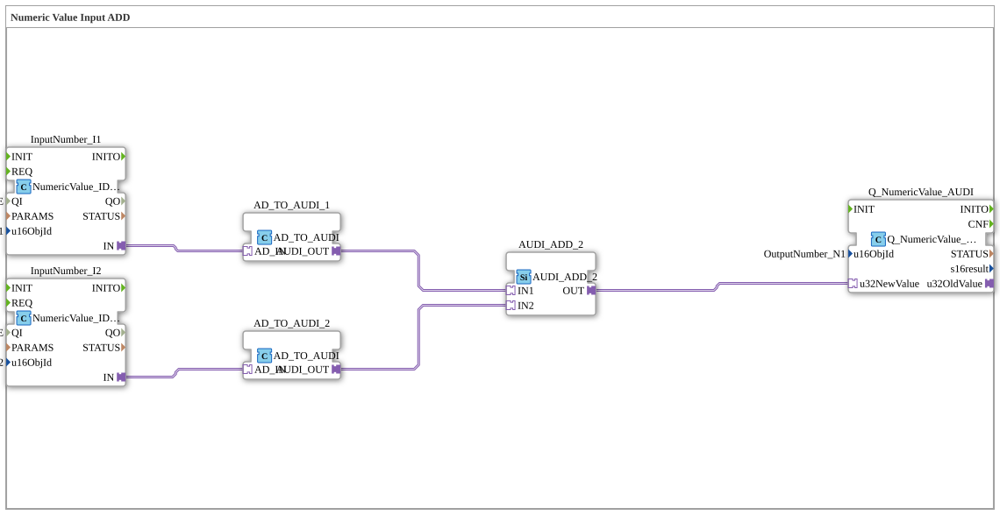

# Exercise_011b1_AUDI: Numeric Value Input ADD

* * * * * * * * * *
## Introduction
This exercise demonstrates the processing of two ISOBUS numeric input values and their addition using special adapter blocks. The two incoming values (integers) are converted into an "AUDI"-compatible type via an adapter (`AD_TO_AUDI`), then summed in an addition block (`AUDI_ADD_2`), and the result is provided as an ISOBUS output object via an output block (`Q_NumericValue_AUDI`).
The focus is on working with adapter connections and type conversion between different data formats in 4diac.

## Function Blocks Used

The subapp `Uebung_011b1_AUDI` contains six function blocks connected via adapters.

### Sub-Blocks: `InputNumber_I1` and `InputNumber_I2`
- **Type**: `isobus::UT::io::NumericValue::NumericValue_IDA`
- **Parameters**:
- `QI` = `TRUE`
- `u16ObjId` = `InputNumber_I1` or `InputNumber_I2`
- **Functionality**:

These blocks provide access to two ISOBUS Numeric Value input objects. They return a numeric value (integer) of the ISOBUS data type at their output adapter `IN`. The parameter `u16ObjId` defines the identifier of the respective input object.

### Sub-blocks: `AD_TO_AUDI_1` and `AD_TO_AUDI_2`
- **Type**: `adapter::conversion::unidirectional::AD_TO_AUDI`
- **Parameters**: none
- **Function**:

These blocks convert an input value of adapter type `AD` (provided by the preceding NumericValue blocks) to adapter type `AUDI`. The conversion is unidirectional and serves to adapt to the subsequent addition block, which only accepts the `AUDI` type.

### Sub-Block: `AX_ADD_2`
- **Type**: `adapter::iec61131::arithmetic::AUDI_ADD_2`
- **Parameters**: none
- **Function**:

This block performs the addition of two `AUDI` input values. The inputs `IN1` and `IN2` are supplied with the converted values via adapter connections. The output `OUT` provides the result as a `AUDI` sum.

### Sub-module: `Q_NumericValue_AUDI`

- **Type**: `isobus::UT::Q::Q_NumericValue_AUDI`
- **Parameters**:
- `u16ObjId` = `OutputNumber_N1`
- **Functionality**:

This module receives the calculated sum value (as type `AUDI`) via the adapter input `u32NewValue` and writes it as an ISOBUS output object with the identifier `OutputNumber_N1`. It thus functions as an output interface to the connected ISOBUS controller.

## Program Flow and Connections

1. The two ISOBUS inputs `InputNumber_I1` and `InputNumber_I2` provide numerical values via their `IN` adapter outputs.

2. A `AD_TO_AUDI` block (`AD_TO_AUDI_1` and `AD_TO_AUDI_2`) converts these values to the `AUDI` adapter type.

3. The converted values are passed to the inputs `IN1` and `IN2` of the addition block `AX_ADD_2`.

4. `AX_ADD_2` calculates the sum and provides it to `OUT`.

5. The sum value is sent to the `u32NewValue` input of the output block `Q_NumericValue_AUDI`, which then outputs it as the ISOBUS output object `OutputNumber_N1`.

The entire data processing takes place in a single cycle without additional event control – the blocks are executed automatically as soon as the input values are available.

## Summary

This exercise demonstrates a complete processing chain for two numeric ISOBUS input values:

- Reading via standardized ISOBUS function blocks (`NumericValue_IDA`),
- Type conversion using adapter function blocks (`AD_TO_AUDI`),
- Arithmetic addition (`AUDI_ADD_2`),
- and output via an ISOBUS output function block (`Q_NumericValue_AUDI`).

It provides fundamental knowledge of working with adapter interfaces and data flow programming in 4diac for industrial ISOBUS applications (e.g., agricultural machinery controls).

---

### 🌐 Related topic subpages on ms-muc-docs.de
* [🌐 Eclipse 4diac IDE & Color Reference on ms-muc-docs.de](https://www.ms-muc-docs.de/iec-61499/eclipse-4diac/)

]
