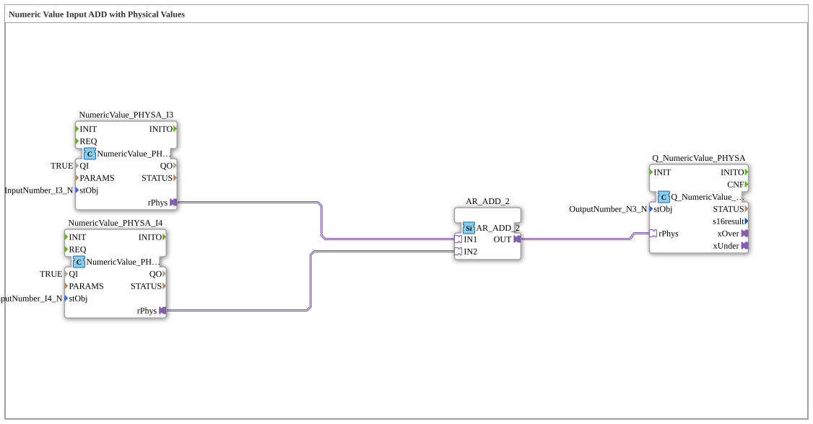

# Exercise_011b1_PHYSA: Numeric Value Input ADD with Physical Values

* * * * * * * * * *
## Introduction

This exercise demonstrates the processing of physical measured values (e.g., voltage, current, speed) using an arithmetic operation. Two input values from defined physical sources are combined using an addition block, and the result is passed to a physical output. The focus is on the correct wiring of the adapter interfaces between the function blocks (FBs) for signal coupling with real I/O channels.
## Function Blocks (FBs) Used

The exercise consists of four directly instantiated function blocks. No further sub-blocks (SubApps) are included.

| Name | Type | Description |
|------|-----|---------------|
| `NumericValue_PHYSA_I3` | `isobus::UT::io::NumericValue::NumericValue_PHYSA` | Reads the physical value from the hardware interface `InputNumber_I3` and provides it as a physical quantity (rPhys). |
| `NumericValue_PHYSA_I4` | `isobus::UT::io::NumericValue::NumericValue_PHYSA` | Same function as above, but for the interface `InputNumber_I4`. |
| `AR_ADD_2` | `adapter::iec61131::arithmetic::AR_ADD_2` | Performs an addition of two physical values (IN1 + IN2) and outputs the result as OUT. |
| `Q_NumericValue_PHYSA` | `isobus::UT::Q::Q_NumericValue_PHYSA` | Writes the passed physical value to the hardware interface `OutputNumber_N3`.
...
### Parameters of Individual Instances

**NumericValue_PHYSA_I3**

- `QI` = TRUE (Activation)
- `stObj` = `InputNumber_I3` (Hardware Interface Object Name)

**NumericValue_PHYSA_I4**

- `QI` = TRUE
- `stObj` = `InputNumber_I4`

**Q_NumericValue_PHYSA**

- `stObj` = `OutputNumber_N3` (Output Interface Object Name)

**AR_ADD_2** – No parameters set; all values are passed via adapter connections.

## Program Flow and Connections

The network connects the function blocks exclusively via adapter channels (type `AdapterConnections`). The data flow is linear:

1. **Input Management**:

The function blocks `NumericValue_PHYSA_I3` and `NumericValue_PHYSA_I4` continuously read the actual physical values of their respective hardware channels (`InputNumber_I3`, `InputNumber_I4`) and make them available at their adapter output `rPhys`.

2. **Arithmetic Operation**:

The function block `AR_ADD_2` receives the two physical values via the adapter inputs `IN1` (from `NumericValue_PHYSA_I3.rPhys`) and `IN2` (from `NumericValue_PHYSA_I4.rPhys`) and adds them together. The result is output at the adapter output `OUT`.

3. **Output**:

The adapter output `AR_ADD_2.OUT` is connected to the adapter input `Q_NumericValue_PHYSA.rPhys`. The output function block takes this value and writes it to the hardware interface `OutputNumber_N3`.

The connections in detail:

- `NumericValue_PHYSA_I3.rPhys` → `AR_ADD_2.IN1`
- `NumericValue_PHYSA_I4.rPhys` → `AR_ADD_2.IN2`
- `AR_ADD_2.OUT` → `Q_NumericValue_PHYSA.rPhys`

## Summary

The exercise **Exercise_011b1_PHYSA** illustrates the structure of a typical measurement processing chain in the 4diac IDE, incorporating physical I/O channels. It demonstrates how two analog input values (e.g., voltages) from different channels are read, added, and written to an analog output. The entire signal chaining is accomplished exclusively via adapter connections – a key concept for modular and hardware-independent automation solutions.

***Learning Objectives***:

- Understanding the adapter interfaces `rPhys` and `stObj`
- Interaction of input, arithmetic, and output modules via adapter connections
- Working with configurable I/O objects (`InputNumber_I3`, `OutputNumber_N3`)
- Fundamentals of physical value processing in the 4diac environment

---

### 🌐 Relevant topic subpages on ms-muc-docs.de

- [🌐 Eclipse 4diac IDE & color reference on ms-muc-docs.de](https://www.ms-muc-docs.de/iec-61499/eclipse-4diac/)
