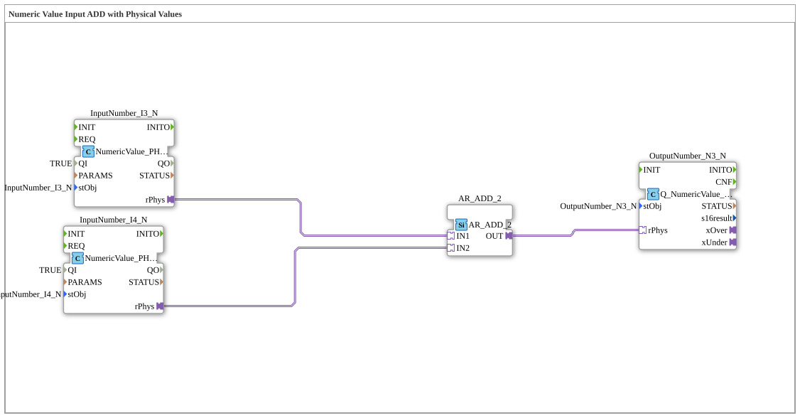

# Exercise_011b3_PHYSA: Numeric Value Input ADD with Physical Values

* * * * * * * * * *
## Introduction
This exercise demonstrates the use of physical values in a simple addition circuit. Two numeric inputs provide physical quantities, which are calculated using an addition block. The result is output as a physical value. The goal is to learn how to use adapter connections between **NumericValue_PHYSA** blocks and the standardized **AR_ADD_2** block.
## Function Blocks (FBs) Used
| Block Name | Type | Short Description |
|---------------|-----|------------------|
| **InputNumber_I3** | `isobus::UT::io::NumericValue::NumericValue_PHYSA` | Physical value input (e.g., with unit). Parameters: `QI` = TRUE, `stObj` = "InputNumber_I3". Provides the entered physical value via the adapter output `rPhys`. |
| **InputNumber_I4** | `isobus::UT::io::NumericValue::NumericValue_PHYSA` | Same type as InputNumber_I3. Parameters: `QI` = TRUE, `stObj` = "InputNumber_I4". |
| **AR_ADD_2** | `adapter::iec61131::arithmetic::AR_ADD_2` | Adder from the IEC 61131 arithmetic library. Receives two physical values at the adapter inputs `IN1` and `IN2` and outputs their sum at the adapter output `OUT`. |
| **OutputNumber_N3** | `isobus::UT::Q::Q_NumericValue_PHYSA` | Physical value output. Receives one physical value via the adapter input `rPhys` and makes it available as an output value. Parameter: `stObj` = "OutputNumber_N3". |

*Note: No sub-modules (SubAppTypes) are used in this exercise.*

## Program Flow and Connections

The flow is implemented entirely via adapter connections:

1. **Acquire Values** – The two input modules `InputNumber_I3` and `InputNumber_I4` deliver their physical values via the adapter outputs `rPhys`.

2. **Addition** – These outputs are connected to the adapter inputs `IN1` and `IN2`, respectively, of the adder `AR_ADD_2`. The adder calculates the sum and outputs the result at its adapter output `OUT`.

3. **Output Value** – The output `OUT` of `AR_ADD_2` is connected to the adapter input `rPhys` of the output module `OutputNumber_N3`. This represents the result as a physical value.

The connections are:

- `InputNumber_I3.rPhys` → `AR_ADD_2.IN1`
- `InputNumber_I4.rPhys` → `AR_ADD_2.IN2`
- `AR_ADD_2.OUT` → `OutputNumber_N3.rPhys`

This exercise requires no prior knowledge. It can be executed directly in the 4diac IDE by creating a new application with this sub-app type and adding the corresponding input/output devices (e.g., virtual sliders or physical I/Os).

## Summary
The sub-app **Exercise_011b3_PHYSA** performs a simple addition of two physical input values. It demonstrates the typical structure of a processing chain with physical quantities: Input → Arithmetic operation → Output. Only adapter connections are used, enabling flexible coupling of the function blocks. This forms the basis for more complex PLC programs with units and physical measurements in the 4diac IDE.

---

### 🌐 Related topic subpages on ms-muc-docs.de
* [🌐 Eclipse 4diac IDE & Color Reference on ms-muc-docs.de](https://www.ms-muc-docs.de/iec-61499/eclipse-4diac/)

]
