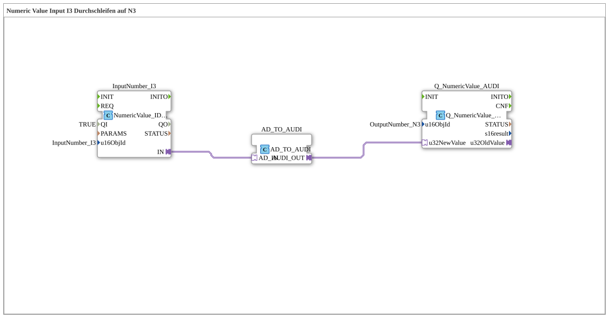

# Exercise_011c_AUDI: Passing Through Numeric Value Input I3 to N3

* * * * * * * * * *

## Introduction

This exercise demonstrates passing through a numeric value from an input block (`InputNumber_I3`) to an output block (`Q_NumericValue_AUDI`) using an adapter block (`AD_TO_AUDI`). The value is transmitted unchanged ("pass-through"). The sub-application is designed as a reusable component for ISOBUS applications.

## Function Blocks (FBs) Used

- **InputNumber_I3**
- **Type**: `isobus::UT::io::NumericValue::NumericValue_IDA`
- **Parameters**:
- `QI` = `TRUE`
- `u16ObjId` = `InputNumber_I3`
- **Function**: Provides a numeric input value (e.g., from a control element) via an adapter output (`IN`).
- **AD_TO_AUDI**
- **Type**: `adapter::conversion::unidirectional::AD_TO_AUDI`
- **Parameters**: None
- **Function**: Converts the input adapter signal (`AD_IN`) into a signal suitable for the output module (`AUDI_OUT`). In this exercise, the value is passed through unchanged.
- **Q_NumericValue_AUDI**
- **Type**: `isobus::UT::Q::Q_NumericValue_AUDI`
- **Parameters**:
- `u16ObjId` = `OutputNumber_N3`
- **Function**: Receives the numeric value via the data input `u32NewValue` and makes it available as an ISOBUS output object (e.g., for display).

## Program Flow and Connections

1. The input block `InputNumber_I3` outputs the current numerical value to its adapter output `IN`.
2. This value is forwarded via an adapter connection to the input `AD_IN` of the block `AD_TO_AUDI`.
3. The adapter `AD_TO_AUDI` passes the received value unchanged to its output `AUDI_OUT`.
4. The value is then passed via the second adapter connection to the data input `u32NewValue` of the output block `Q_NumericValue_AUDI`.
5. The output block then provides the value as an ISOBUS output object `OutputNumber_N3`.

The entire data transfer is event-driven – as soon as the input value changes, the chain is automatically traversed.

## Summary

This exercise demonstrates the fundamental principle of data exchange between ISOBUS input and output blocks using an adapter. It teaches the construction of a simple pass-through logic and prepares students for more complex processing steps in later exercises. The focus is on understanding adapter connections and the parameterization of the NumericValue blocks.
