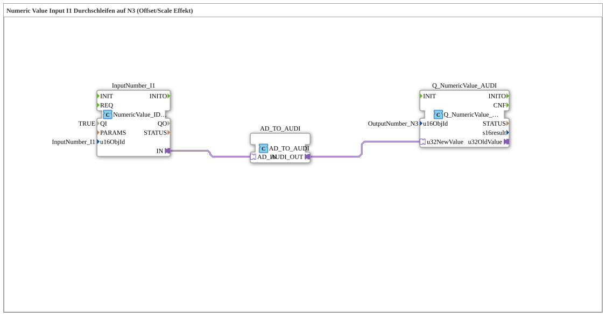

# Exercise_011d_AUDI: Passing Numeric Value Input I1 to N3 (Offset/Scale Effect)

* * * * * * * * * *
## Introduction

This exercise demonstrates passing a numeric input value (I1) to an output (N3) using an offset/scale effect. The incoming value is converted via an adapter and passed to an output function block.
Example:

- Input of 100000 on I1 → N3 displays 0.00
- Input of 50000 on I1 → N3 displays -500.00

## Function Blocks (FBs) Used

- **InputNumber_I1**
- **Type**: `isobus::UT::io::NumericValue::NumericValue_IDA`
- **Parameters**:
- `QI` = TRUE
- `u16ObjId` = InputNumber_I1
- **Function**: Reads the numeric value of the ISOBUS object "InputNumber_I1" and provides it via the adapter output `IN`.
- **AD_TO_AUDI**
- **Type**: `adapter::conversion::unidirectional::AD_TO_AUDI`
- **Parameters**: No explicit parameters
- **Function**: Converts the incoming adapter value (AD) into an AUDI-compatible value. The input value is processed with an internal offset and scaling factor to achieve the desired effect.
- **Q_NumericValue_AUDI**
- **Type**: `isobus::UT::Q::Q_NumericValue_AUDI`
- **Parameters**:
- `u16ObjId` = OutputNumber_N3
- **Function**: Receives the converted value via data port `u32NewValue` and writes it to the ISOBUS output object "OutputNumber_N3".

## Program Flow and Connections

1. The function block `InputNumber_I1` acquires the current value of the ISOBUS input object.
2. The value is forwarded from `InputNumber_I1.IN` to `AD_TO_AUDI.AD_IN` via the **adapter connection**.
3. The value is converted (offset/scaled) in the function block `AD_TO_AUDI`.
4. The calculated AUDIO value leaves the function block via output `AUDI_OUT` and is passed to data input `u32NewValue` from `Q_NumericValue_AUDI`.
5. `Q_NumericValue_AUDI` writes the final value to the output object "OutputNumber_N3".

The entire logic is implemented as a sub-application and uses no further sub-components. The process is purely data-driven – as soon as the input value changes, the entire chain is executed.

## Summary

The exercise "Exercise_011d_AUDI" illustrates how a numeric ISOBUS input value is converted into an output value via an adapter block with offset/scaling. It provides training in working with adapter connections, parameterizing ISOBUS objects, and understanding scaling effects in the 4diac IDE.

---

### 🌐 Related topic subpages on ms-muc-docs.de

* [🌐 Eclipse 4diac IDE & Color Reference on ms-muc-docs.de](https://www.ms-muc-docs.de/iec-61499/eclipse-4diac/)

]
