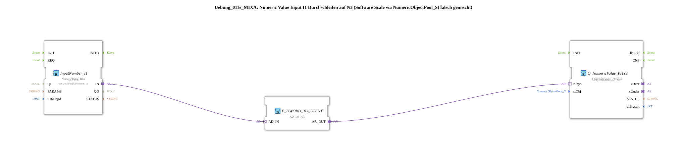

# Exercise_011e_MIXA: Passing through Numeric Value Input I1 to N3 (Software Scale via NumericObjectPool_S) incorrectly!

* * * * * * * * * *
## Introduction
This exercise demonstrates the incorrect passing through of a numeric input value from **InputNumber_I1** to **OutputNumber_N3**. The value is passed without correct scaling (software scale) because the namespaces used, `DefaultPool` and `DefaultPool_Numeric`, are incompatible. The goal is to raise awareness of the problem of correctly mapping source and target objects.

## Function Blocks (FBs) Used

### InputNumber_I1
- **Type**: `isobus::UT::io::NumericValue::NumericValue_IDA`
- **Parameters**:
- `QI` = `TRUE`
- `u16ObjId` = `InputNumber_I1`
- **Functionality**:

Reads the current value of the numeric input **I1** from the pool `DefaultPool` and makes it available at the adapter output `IN`.

### F_DWORD_TO_UDINT
- **Type**: `adapter::conversion::unidirectional::AD_TO_AR`
- **Parameters**: none
- **Function**:

Converts the DWORD value at the adapter input `AD_IN` into a UDINT value and outputs it at the adapter output `AR_OUT`.

### Q_NumericValue_PHYS
- **Type**: `isobus::UT::Q::Q_NumericValue_PHYSA`
- **Parameters**:
- `stObj` = `OutputNumber_N3`
- **Functionality**:

Receives the converted value via the adapter input `rPhys` and writes it to the numeric output **N3** of the pool `DefaultPool_Numeric`.

## Program Flow and Connections

The SubApp network connects the three function blocks in a chain:

1. **InputNumber_I1** → returns the current value of I1 as a DWORD at its adapter output `IN`.

2. **F_DWORD_TO_UDINT** → receives the DWORD value at `AD_IN`, converts it to a UDINT, and outputs it to `AR_OUT`.

3. **Q_NumericValue_PHYS** → receives the UDINT value at `rPhys` and writes it to the original object `OutputNumber_N3`.

**Note**: The namespaces of the two objects are incompatible:

- `InputNumber_I1` originates from `Uebungen::const::UT::DefaultPool`.
- `OutputNumber_N3` originates from `Uebungen::const::UT::DefaultPool_Numeric`.

Therefore, while the value is technically passed on, the scaling or object association (software scale) is not correctly configured – this exercise serves as a negative example.

## Summary

This exercise demonstrates a deliberately misconfigured setup where an input value is passed through to an output in a different namespace without adjusting the scaling. The expected effect: The value is displayed (e.g., 10.00), but the underlying object mapping is inconsistent. This highlights the need to use source and target objects from the same pool or to implement explicit scaling.
