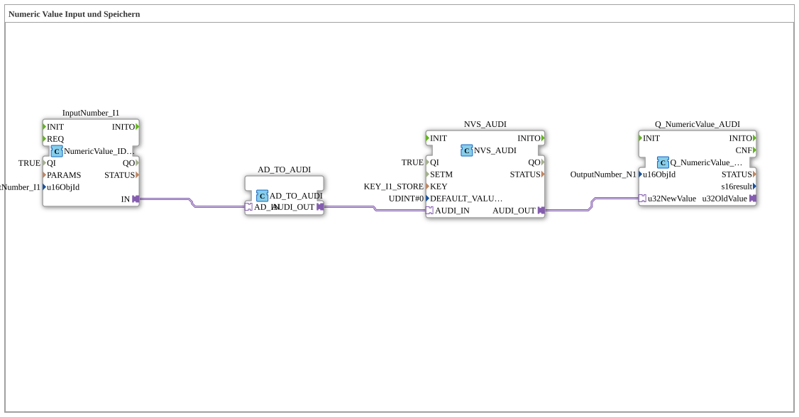

# Exercise_012_AUDI: Numeric Value Input and Storage

* * * * * * * * * *

## Introduction

This exercise demonstrates the acquisition of a numeric value via the isobus I/O stack, its conversion into a format compatible with the audio control system, and its persistent storage in non-volatile memory (NVS). The stored value is then output via another isobus output module. The goal is to understand the data flow between input, conversion, storage, and output.

## Function Blocks (FBs) Used

- **AD_TO_AUDI**
- **Type**: `adapter::conversion::unidirectional::AD_TO_AUDI`
- **Parameters**: None
- **Functionality**: Converts the adapter signal (ISOBUS side) from the input block into an adapter-based signal for the audio components. Establishes the unidirectional connection between the ISOBUS adapter and the NVS adapter.
- **InputNumber_I1**
- **Type**: `isobus::UT::io::NumericValue::NumericValue_IDA`
- **Parameters**:
- `QI` = `TRUE`
- `u16ObjId` = `InputNumber_I1`
- **Functionality**: Receives a numeric value from the isobus network (defined by the object ID `InputNumber_I1`) and passes it to the conversion module via its adapter output (`IN`).
- **NVS_AUDI**
- **Type**: `logiBUS::storage::esp32_nvs::NVS_AUDI`
- **Parameters**:
- `QI` = `TRUE`
- `KEY` = `KEY_I1_STORE`
- `DEFAULT_VALUE` = `UDINT#0`
- **Functionality**: Stores the value present at its adapter input persistently in non-volatile memory under the key `KEY_I1_STORE`. If no value is stored, the default value `0` is used. The stored value is made available via the adapter output.

- **Q_NumericValue_AUDI**

- **Type**: `isobus::UT::Q::Q_NumericValue_AUDI`
- **Parameters**:
- `u16ObjId` = `OutputNumber_N1`
- **Functionality**: Receives the numeric value supplied by the NVS block and outputs it to the network under the isobus object ID `OutputNumber_N1`.

## Program Flow and Connections

The blocks are linked exclusively via adapter connections:

1. The **InputNumber_I1** block reads a numeric value from the isobus network and sends it to the **AD_TO_AUDI** block via its adapter output `IN`.

**Program Flow and Connections**

**InputNumber_I1** block reads a numeric value from the isobus network and sends it to the **AD_TO_AUDI** block via its adapter output `IN`.**

**Function**: Received by the NVS block and outputs it to the isobus block. 2. **AD_TO_AUDI** converts the incoming ISOBUS adapter signal into an Audi-compatible adapter signal and forwards it to the **NVS_AUDI** module via its output `AUDI_OUT`.

1. **NVS_AUDI** persistently stores the received value and simultaneously makes it available via its adapter output `AUDI_OUT`.
2. The output of **NVS_AUDI** is connected to the data input (`u32NewValue`) of the **Q_NumericValue_AUDI** module, which then publishes the value on the ISOBUS output `OutputNumber_N1`.

... The entire processing is event-driven: As soon as a new value arrives at the input, it passes through the chain and is both stored and immediately output.

## Summary

This exercise maps the entire path of a numeric value from the isobus input through adapter conversion and persistent storage to network output. The use of adapter interfaces enables loose coupling between the components. The learner gains practical insight into data processing with isobus modules and the integration of non-volatile memory into a 4diac application.

---

### 🌐 Related topic subpages on ms-muc-docs.de

- [🌐 Eclipse 4diac IDE & color reference on ms-muc-docs.de](https://www.ms-muc-docs.de/iec-61499/eclipse-4diac/)

]
