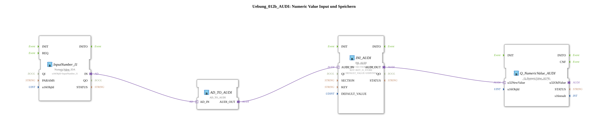

# Exercise_012b_AUDI: Numeric Value Input and Storage

* * * * * * * * * *
## Introduction
This exercise demonstrates the acquisition of a numeric value via an ISOBUS input, its conversion into a storable format, and its persistent storage using an INI-based storage mechanism. The stored value is then read back and provided as an ISOBUS output value. The function blocks communicate via adapter interfaces (AUDI), which enable standardized data transfer.
## Function Blocks Used

The exercise consists of a sub-application network containing four function blocks and their adapter connections. No further sub-blocks (nested sub-applications) are used.

- **InputNumber_I1** (Type: `isobus::UT::io::NumericValue::NumericValue_IDA`)
- Parameters: `QI = TRUE`, `u16ObjId = InputNumber_I1`
- Input: Adapter interface `IN`
- Function: Reads a numeric value from an ISOBUS input (Object ID `InputNumber_I1`). The output value is passed to the next stage via the adapter output `AD_IN`.
- **AD_TO_AUDI** (Type: `adapter::conversion::unidirectional::AD_TO_AUDI`)
- Function: Converts the data format of the previous adapter (`AD` interface) to the AUDI format. This ensures compatibility between different adapter types.
- **INI_AUDI** (Type: `eclipse4diac::storage::INI_AUDI`)
- Parameters: `QI = TRUE`, `SECTION = SECTION_I1_STORE`, `KEY = KEY_I1_STORE`, `DEFAULT_VALUE = UDINT#55`
- Input: Adapter interface `AUDI_IN`
- Function: Writes the passed numeric value to an INI memory (section `SECTION_I1_STORE`, key `KEY_I1_STORE`). If no valid value is provided, the default value 55 is used. The stored value is output via the adapter output `AUDI_OUT`.
- **Q_NumericValue_AUDI** (Type: `isobus::UT::Q::Q_NumericValue_AUDI`)
- Parameter: `u16ObjId = OutputNumber_N1`
- Input: Data port `u32NewValue` (connected to the adapter output of `INI_AUDI`)
- Function: Sets the passed 32-bit value as the new output value for the ISOBUS object ID `OutputNumber_N1`. The value is then output on the ISOBUS data field.

```
### Compiler Imports

This exercise imports the following constants from the libraries `Uebungen::const::NVS::NVS_Keys` and `Uebungen::const::UT::DefaultPool`:

- `KEY_I1_STORE` – the key for the INI memory
- `SECTION_I1_STORE` – the section identifier for the INI memory
- `InputNumber_I1` – the ISOBUS object ID of the input value
- `OutputNumber_N1` – the ISOBUS object ID of the output value

## Program Flow and Connections

1. The function block **InputNumber_I1** receives a numeric value from the ISOBUS interface and outputs it via its adapter output `IN`.

``` 2. This adapter output is connected to the adapter input `AD_IN` of **AD_TO_AUDI**. This function block converts the data format and makes the value available at its output `AUDI_OUT`.

3. The output `AD_TO_AUDI.AUDI_OUT` is connected to the adapter input `AUDI_IN` of **INI_AUDI**. This persistently stores the value in an INI section.

4. The stored value is passed from the adapter output `INI_AUDI.AUDI_OUT` to the data port `u32NewValue` of **Q_NumericValue_AUDI**.

` 5. **Q_NumericValue_AUDI** then sets the ISOBUS output value with object ID `OutputNumber_N1` to this value.

The entire data chain is unidirectional and operates without explicit event control – execution is performed cyclically by the runtime environment.

**Learning Objectives:**

- Understanding adapter-based data transfer between different function blocks.
- Familiarity with the INI memory block (`INI_AUDI`) for persistent storage of values.
- Application of ISOBUS input/output blocks with configurable object IDs.

**Prerequisites:**

Basic knowledge of the 4diac IDE, creating sub-applications, and working with adapters.

**Exercise Notes:**

The constants `SECTION_I1_STORE` and `KEY_I1_STORE` must be defined as NVS constants in the project. The default value of 55 serves as a fallback if no value has yet been stored.

## Summary

Exercise **Exercise_012b_AUDI** demonstrates a complete data path from ISOBUS input through format conversion, persistent storage in an INI structure, to ISOBUS output. It illustrates the use of adapters for coupling different component types and the use of memory components for persistent data storage. After successful completion, participants will be able to independently implement similar data storage and forwarding chains in their own projects.

### 🌐 Related topic subpages on ms-muc-docs.de
* [🌐 Eclipse 4diac IDE & Color Reference on ms-muc-docs.de](https://www.ms-muc-docs.de/iec-61499/eclipse-4diac/)

]
