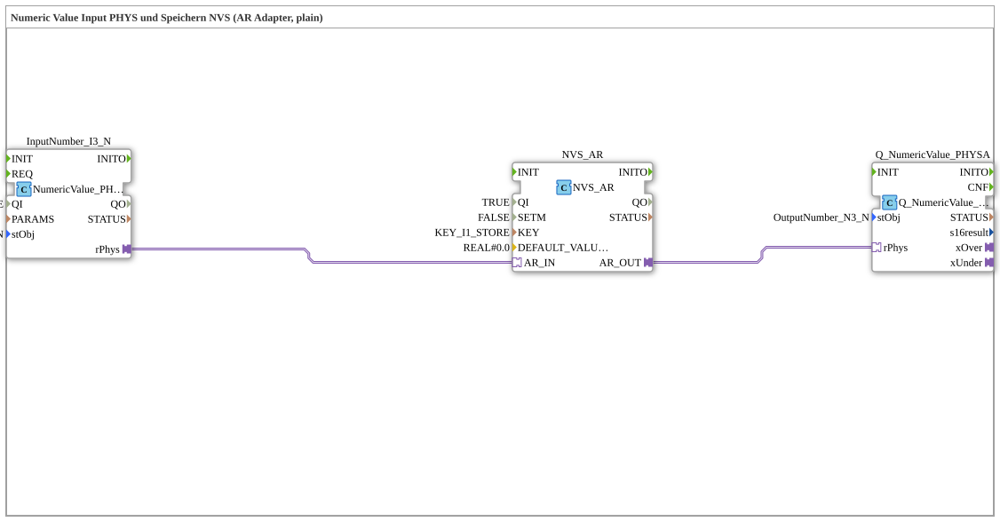

# Exercise_012d_AR: Numeric Value Input PHYS and Storage NVS (AR Adapter, plain)

* * * * * * * * * *

## Introduction

This exercise demonstrates the acquisition of a numeric value via a physical input (PHYS), the storage of the value in non-volatile memory (NVS), and the subsequent output. Communication between the function blocks is handled via an AR adapter (adapter interface), without the use of sub-blocks.

## Function Blocks (FBs) Used

- **InputNumber_I3**
- **Type**: `isobus::UT::io::NumericValue::NumericValue_PHYSA`
- **Parameters**:
- `QI` = `TRUE` (Activation of the block)
- `stObj` = `InputNumber_I3` (Reference to the physical input object)
- **Function**: Reads a numeric value from a physical input interface and provides it via the output adapter `rPhys`.
- **NVS_AR**
- **Type**: `logiBUS::storage::esp32_nvs::NVS_AR`
- **Parameters**:
- `QI` = `TRUE` (Activation)
- `KEY` = `KEY_I1_STORE` (Memory key in NVS)
- `DEFAULT_VALUE` = `REAL#0.0` (Default value if no value is stored yet)
- **Function**: Stores an incoming value in non-volatile memory (NVS) and outputs the stored (or default) value via the output adapter `AR_OUT`. The adapter input `AR_IN` accepts input data.
- **Q_NumericValue**
- **Type**: `isobus::UT::Q::Q_NumericValue_PHYSA`
- **Parameters**:
- `stObj` = `OutputNumber_N3` (reference to the physical output object)
- **Function**: Outputs a received numeric value via a physical output interface. The data is provided via the adapter input `rPhys`.

## Program Flow and Connections

The function blocks are connected via adapter interfaces:

1. **Input**: The block `InputNumber_I3` reads the current value of a physical numeric input (e.g., potentiometer or sensor) and provides it at the output adapter `rPhys`.
2. **Storage and Transmission**: The adapter output `InputNumber_I3.rPhys` is connected to the adapter input `NVS_AR.AR_IN`. The module `NVS_AR` stores the received value under the key `KEY_I1_STORE` in non-volatile memory and outputs the stored value (or, if no value is present, the default value) via the output adapter `AR_OUT`.
3. **Output**: The adapter output `NVS_AR.AR_OUT` is connected to the adapter input `Q_NumericValue.rPhys`. The module `Q_NumericValue` outputs the received value on the physical output `OutputNumber_N3` (e.g., a display or analog signal).

**Learning Objectives of the Exercise:**

- Using AR adapters for data transfer between function blocks.
- Combining physical input/output with non-volatile memory.
- Parameterizing memory blocks (NVS) with keys and default values.

**Difficulty Level:** Medium
**Prerequisites:** Basic knowledge of the 4diac IDE, understanding of function blocks and adapters.

## Summary

The exercise `Uebung_012d_AR` implements a simple pipeline: physical input → storage in NVS → physical output. Data transfer occurs exclusively via AR adapters, eliminating the need for complex connections between individual inputs/outputs. The stored value is retained even after a restart. This exercise teaches the use of NVS memory and adapter-based communication in the 4diac development environment.

---

### 🌐 Related topic subpages on ms-muc-docs.de

- [🌐 Eclipse 4diac IDE & Color Reference on ms-muc-docs.de](https://www.ms-muc-docs.de/iec-61499/eclipse-4diac/)
