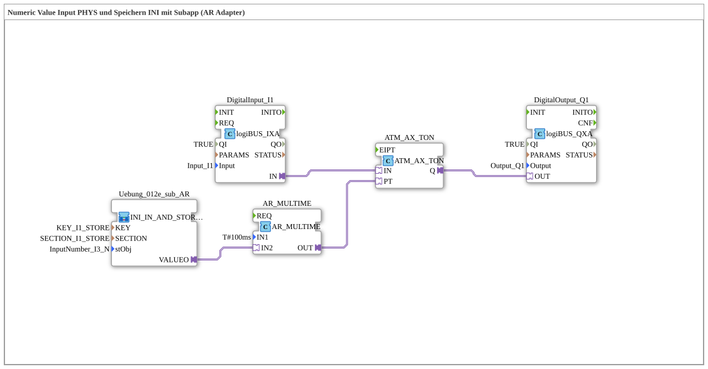

# Exercise_012e2_AR: Numeric Value Input PHYS and Storing INI with Subapp (AR Adapter)

* * * * * * * * * *
## Introduction

This exercise demonstrates the use of an **AR adapter** to combine a logiBUS digital input, a configurable time base, and a timer value configured via a sub-app block, which is loaded from a non-volatile storage (NVS). A digital input signal starts a timer whose expiration time is set via a stored numeric value (INI). The timer output switches a digital output. The key feature is the AR adapter's connection between the storage block, the arithmetic unit, and the timer.
## Function Blocks (FBs) Used

### Sub-Blocks: Exercise_012e_sub_AR

- **Type**: `MyLib::sys::INI_IN_AND_STORE_AR`
- **Internal FBs Used**: (not included in the provided XML; the block is imported as a predefined sub-application type)
- Parameters:
- `KEY` = `KEY_I1_STORE` (constant from `Uebungen::const::NVS::NVS_Keys`)
- `SECTION` = `SECTION_I1_STORE` (constant from `Uebungen::const::NVS::NVS_Keys`)
- `stObj` = `InputNumber_I3` (constant from (`Uebungen::const::UT::DefaultPool_Numeric`)
- **Functionality**: Upon initialization, the sub-module loads a numeric value (e.g., a timer setpoint) from the NVS under the specified key and section name. The stored value is made available at the AR adapter output `VALUEO`. It serves as a variable operand for subsequent arithmetic processing.

**Functionality**:
### Further Function Blocks

- **DigitalInput_I1**
- **Type**: `logiBUS::io::DI::logiBUS_IXA`
- Parameters: `QI` = `TRUE`, `Input` = `Input_I1`
- Event output/input: AR adapter (`IN`)
- Data output/input: –
- **AX_TON**
- **Type**: `adapter::events::unidirectional::timers::ATM_AX_TON`
- Parameters: none
- Event output/input: `IN` (adapter), `Q` (adapter)
- Data output/input: `PT` (Timer preset time) via AR adapter
- **AR_MULTIME**
- **Type**: `adapter::iec61131::arithmetic::AR_MULTIME`
- Parameters: `IN1` = `T#100ms` (Fixed multiplier)
- Data output/input: `IN2` (Multiplicand), `OUT` (Result) via AR adapter
- **DigitalOutput_Q1**
- **Type**: `logiBUS::io::DQ::logiBUS_QXA`
- Parameters: `QI` = `TRUE`, `Output` = `Output_Q1`
- Event output/input: AR adapter (`OUT`)
- Data output/input: –

## Program Flow and Connections

1. **Digital Input**

The function block `DigitalInput_I1` provides the physical signal `Input_I1` (e.g., push button or sensor) as an AR adapter signal `IN`.

2. **Timer Start**

This signal is directly connected to the `IN` adapter of the timer `AX_TON`.

- The timer starts on a rising edge (ON).
3. **Variable Timer Time**

The sub-block `Uebung_012e_sub_AR` outputs the numeric value loaded from the NVS via its AR output `VALUEO`.

- This value is passed via the AR adapter to the `IN2` input of the arithmetic block `AR_MULTIME`.
- The block `AR_MULTIME` multiplies the fixed value `T#100ms` (IN1) by the variable value (IN2) and outputs the result (Time) at its `OUT` adapter.

- The output `OUT` is connected to the `PT` adapter of the timer `AX_TON`. This allows the timer's expiration time to be calculated dynamically from the stored value.

4. **Digital Output**

The timer output `Q` of `AX_TON` switches the `OUT` adapter of the output module `DigitalOutput_Q1`. This activates the physical output `Output_Q1` while the timer is running or after the set time has elapsed.

4. **Digital Output**

The timer output `Q` of `AX_TON` switches the `OUT` adapter of the output module `DigitalOutput_Q1`. **Explanation of Network Connections**:

- `DigitalInput_I1.IN` → `AX_TON.IN`
- `AX_TON.Q` → `DigitalOutput_Q1.OUT`
- `Uebung_012e_sub_AR.VALUEO` → `AR_MULTIME.IN2`
- `AR_MULTIME.OUT` → `AX_TON.PT`

## Summary

**Learning Objectives**:

- Integration of an AR adapter-based sub-app component for persistent storage of configuration values (NVS).
- Arithmetic operation of constants and stored values via AR adapter.
- Implementation of an adjustable timer function with a digital input and output.
- Understanding of adapter-based communication between function blocks from different libraries.

**Difficulty Level**: Medium

**Required Prior Knowledge**: Basic knowledge of the 4diac IDE, experience with logiBUS modules, AR adapters, and NVS constants.

**Starting the Exercise**: Import the SubApp template `Uebung_012e2_AR` into a new 4diac project, ensure that the required libraries (`logiBUS`, `MyLib`, `Uebungen::const`) are in the build path, and connect the physical I/O points according to the hardware.

---

### 🌐 Related topic subpages on ms-muc-docs.de

* [🌐 Eclipse 4diac IDE & Color Reference on ms-muc-docs.de](https://www.ms-muc-docs.de/iec-61499/eclipse-4diac/)
