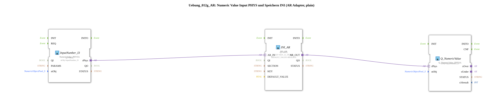

# Exercise_012g_AR: Numeric Value Input PHYS and Storage INI (AR Adapter, plain)

* * * * * * * * * *
## Introduction

In this exercise, a numeric value (REAL) is read via a physical input and permanently stored using the INI_AR adapter. The stored value can then be visualized via another output block. The exercise demonstrates the use of the AR adapter interface (adapter resource) for communication between a physical input block and a memory block, as well as a numeric output.
## Function Blocks Used (FBs)

The following function blocks are used. The sub-app contains no other sub-blocks.

---

### FB: `InputNumber_I3`

- **Type**: `isobus::UT::io::NumericValue::NumericValue_PHYSA`
- **Parameters**:
- `QI` = `TRUE` (Initial value for the input quality)
- `stObj` = `InputNumber_I3` (Reference to the physical input object)
- **Adapter**:
- Output adapter (`rPhys`) for passing the numeric value
- **Functionality**:

The function block reads a numeric value (REAL) from the configured physical input source. The value is passed to subsequent function blocks via the `rPhys` adapter output.

---

### FB: `INI_AR`

- **Type**: `eclipse4diac::storage::INI_AR`
- **Parameters**:
- `QI` = `TRUE` (Activate the saving process)
- `KEY` = `KEY_I1_STORE` (Save key, imported from `Uebungen::const::NVS::NVS_Keys`)
- `DEFAULT_VALUE` = `REAL#0.0` (Default value if no value has been saved yet)
- **Adapter**:
- Input adapter (`AR_IN`) for the value to be saved
- Output adapter (`AR_OUT`) for the read stored value
- **Functionality**:

This function block stores a value received from the `AR_IN` adapter under the specified key in non-volatile memory (NVS). At startup or after saving, the stored value is made available at the `AR_OUT` adapter. The `DEFAULT_VALUE` adapter is used if no value has yet been stored.

### FB: `Q_NumericValue`

- **Type**: `isobus::UT::Q::Q_NumericValue_PHYSA`
- **Parameters**:
- `stObj` = `InputNumber_I3` (reference to the same physical object as the input)
- **Adapter**:
- Input adapter (`rPhys`) for the value to be displayed
- **Functionality**:

This function block passes the numeric value received via the `rPhys` adapter to the configured output (e.g., a display or a virtual output). It is used for visualizing or further processing the current or stored value.

## Program Flow and Connections

The function blocks are connected exclusively via **adapters**. The network consists of three modules connected as follows:

1. **`InputNumber_I3.rPhys` → `INI_AR.AR_IN`**

The physical value read from the input module is directly transferred to the INI_AR memory module.

2. **`INI_AR.AR_OUT` → `Q_NumericValue.rPhys`**

The value read back from memory (either the newly stored or the last stored value) is forwarded to the output module.

This creates a simple pipeline:

**Read → Store → Output**

The operation is event-driven (running in the background via the adapters). The parameters `QI` of both modules are permanently set to `TRUE`, ensuring continuous data flow.

**Learning Objectives:**

- Understanding the AR adapter interface for communication between function blocks
- Setting up persistent memory using the `INI_AR` function block
- Interaction of physical input, memory, and output

**Difficulty Level:** Medium
**Prerequisites:** Basic knowledge of the 4diac IDE, working with function blocks and adapters

## Summary

The exercise `Uebung_012g_AR` demonstrates a compact implementation of a numeric value memory using the AR adapter concept. The value is read from a physical input, persisted via the `INI_AR` function block, and then displayed via an output block. The solution consists of three specialized function blocks connected via adapters, thus enabling a clean separation of input, memory, and output logic.

---

### 🌐 Related topic subpages on ms-muc-docs.de

- [🌐 Eclipse 4diac IDE & Color Reference on ms-muc-docs.de](https://www.ms-muc-docs.de/iec-61499/eclipse-4diac/)
