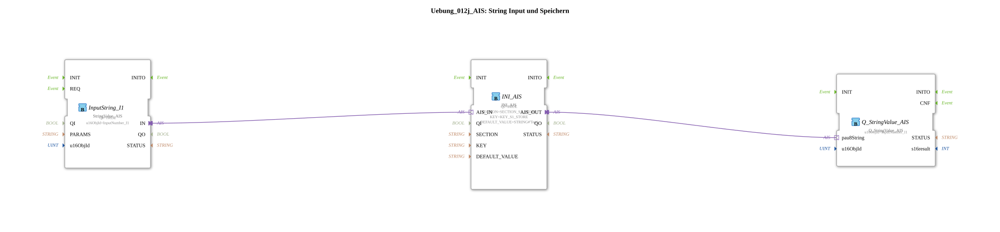

# Exercise_012j_AIS: String Input and Storage

* * * * * * * * * *
## Introduction

This exercise demonstrates reading a string value via a virtual input, storing it in non-volatile memory (NVS), and then outputting the stored value. It shows how to use the adapter interfaces of the 4diac IDE and how to utilize predefined constants for memory areas.
The goal is to store an initial value (default: "Test") in NVS and output it using a function block, with the value being loaded from memory on every restart.

## Function Blocks Used (FBs)

The exercise consists of three function blocks connected via adapters:

### FB: InputString\_I1

- **Type**: `isobus::UT::io::StringValue::StringValue_AIS`
- **Parameters**:
- `QI` = `TRUE` (Block active)
- `u16ObjId` = `InputNumber\_I1` (Constant for identifying the input object)
- **Event output/input**: Default INIT/REQT (not configured in detail)
- **Data output/input**: Output `IN` (Adapter output, returns the input string)
- **Functionality**: This block reads a string value from a virtual input point (e.g., HMI or simulation) and outputs it via The adapter `IN` is available. Its value is identified by the object ID `InputNumber_I1`.

### FB: INI\_AIS

- **Type**: `eclipse4diac::storage::INI_AIS`
- **Parameters**:
- `QI` = `TRUE` (Block active)
- `SECTION` = `SECTION_S1_STORE` (Constant for memory section)
- `KEY` = `KEY_S1_STORE` (Constant for memory key)
- `DEFAULT_VALUE` = `STRING#'Test'` (Default value if no value is stored yet)
- **Event output/input**: Default INIT/REQT
- **Data output/input**:
- `AIS_IN` (Adapter input, expects a string)
- `AIS_OUT` (Adapter output, returns the stored or loaded string)
- **Functionality**: This module functions as a memory access point for non-volatile memory (NVS). It stores a string received via `AIS_IN` under the specified section and key. If no new value is supplied, it returns the last stored value or `DEFAULT_VALUE` via `AIS_OUT`.

### FB: Q\_StringValue\_AIS

- **Type**: `isobus::UT::Q::Q_StringValue_AIS`
- **Parameters**:
- `u16ObjId` = `InputNumber_I1` (same object ID as input)
- **Event Output/Input**: Standard INIT/REQT
- **Data Output/Input**:
- `pau8String` (adapter input, expects the string to be displayed)
- **Functionality**: This function block passes the string received via `pau8String` to an output location (e.g., display, higher-level application). The output is based on the object ID `InputNumber_I1`.

## Program Flow and Connections

Data flow within the sub-app occurs via adapter connections:

1. **Input**: `InputString_I1` provides the current string (from the HMI or a simulation) at its adapter output `IN`.
2. **Save**: The adapter output `IN` is connected to the adapter input `AIS_IN` of `INI_AIS`. `INI_AIS` stores this value in non-volatile memory (section and key according to the constants).
3. **Output**: The stored (or loaded) value is provided by `INI_AIS` via the adapter output `AIS_OUT`. This is connected to the adapter input `pau8String` of `Q_StringValue_AIS`, which passes the value to the output location.

The subapp is designed so that the last saved value from the NVS is automatically loaded and output on each startup (DEFAULT_VALUE serves as the initial value). An external application can overwrite the input value, whereupon the new value is saved and immediately output.

Notes:

- The constants `InputNumber_I1`, `SECTION_S1_STORE`, and `KEY_S1_STORE` are defined in higher-level libraries and must be imported before use.
- This exercise demonstrates a typical pattern for persistent data storage in automation technology.

## Summary

The exercise **Exercise_012j_AIS** demonstrates the basic handling of string data in combination with non-volatile memory (NVS) in the 4diac IDE. Using adapter connections, database-like access to stored values is achieved. The three function blocks – input, storage, and output – form a reusable component that can be used in various applications for the persistent storage of user input. The predefined constants ensure a clear separation of memory areas and simplify maintenance.

---

### 🌐 Related topic subpages on ms-muc-docs.de

* [🌐 Eclipse 4diac IDE & Color Reference on ms-muc-docs.de](https://www.ms-muc-docs.de/iec-61499/eclipse-4diac/)

]
