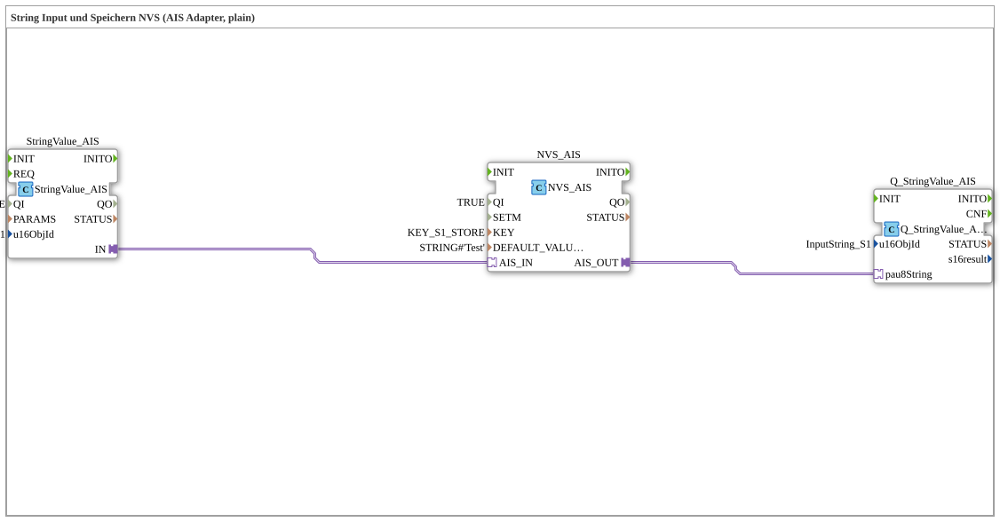

# Exercise_012l_AIS: String Input and Storage NVS (AIS Adapter, plain)

* * * * * * * * * *
## Introduction
This exercise demonstrates the use of the AIS adapter protocol for communication between a string input block and non-volatile memory (NVS). The entered string is passed to the NVS block via an AIS adapter and stored there. A read block then retrieves the currently stored value. This exercise serves as a simple example of storing configuration or status data using the AIS model in 4diac.
## Function Blocks Used (FBs)

### StringValue_AIS
- **Type**: `isobus::UT::io::StringValue::StringValue_AIS`
- **Parameters**:
- `QI` = `TRUE` (Input enabled)
- `u16ObjId` = `InputString_S1` (Object ID of the input string)
- **Functionality**: This function block provides an AIS adapter through which a string can be input. It is the source of the value to be stored.

### NVS_AIS
- **Type**: `logiBUS::storage::esp32_nvs::NVS_AIS`
- **Parameters**:
- `QI` = `TRUE` (Input enabled)
- `KEY` = `KEY_S1_STORE` (Memory key in NVS)
- `DEFAULT_VALUE` = `STRING#'Test'` (Default value if the key does not exist)
- **Functionality**: This function block implements non-volatile memory (NVS) with an AIS interface. A string is received via AIS_IN and stored under the specified key. The stored string (or the default value) is output via AIS_OUT.

``` ### Q_StringValue_AIS

- **Type**: `isobus::UT::Q::Q_StringValue_AIS`
- **Parameters**:
- `u16ObjId` = `InputString_S1` (Object ID of the output string)
- **Functionality**: This function block receives the currently stored string from the NVS via its AIS adapter and makes it available for further processing (e.g., display).

## Program Flow and Connections

The three function blocks are connected via AIS adapters:

1. **StringValue_AIS.IN** → **NVS_AIS.AIS_IN**: The string entered by the user is forwarded directly to the NVS function block.

2. **NVS_AIS.AIS_OUT** → **Q_StringValue_AIS.pau8String**: The string stored in the NVS (or the default string) is sent to the output block.

The process is cyclical: As soon as a new string is entered, the NVS updates the stored value and passes it on via the output. This exercise requires no additional events, as the AIS adapters control the data flows themselves.

**Learning Objectives**:

- Understanding the AIS adapter concept for data exchange between function blocks.
- Simple persistent storage of strings in the NVS.
- Configuration of object IDs and memory keys.

**Prerequisites**: Basic knowledge of 4diac and the AIS adapter model.

## Summary
The exercise **Exercise_012l_AIS** demonstrates a minimalist chain: String input → NVS storage → Output via AIS. It demonstrates how configuration data can be permanently stored and retrieved with minimal effort. The implementation uses the AIS adapter protocol without requiring additional event connections.

---

### 🌐 Related topic subpages on ms-muc-docs.de
* [🌐 Eclipse 4diac IDE & Color Reference on ms-muc-docs.de](https://www.ms-muc-docs.de/iec-61499/eclipse-4diac/)

]