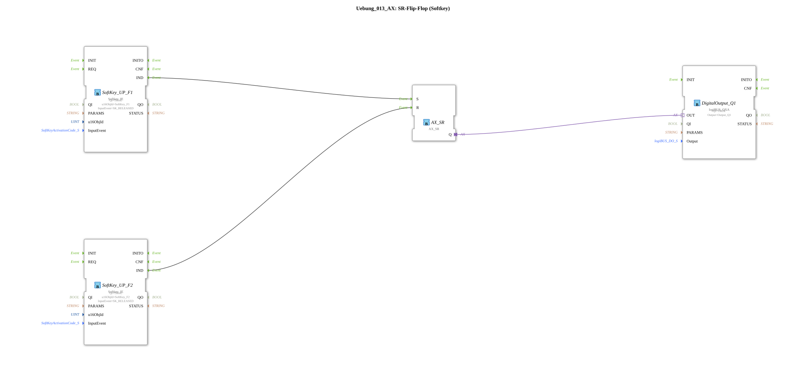

# Exercise_013_AX: SR Flip-Flop (Softkey)

This article describes the logiBUS® exercise `Uebung_013_AX`.
## 🎧 Podcast

* [ISO 11783-6: Understanding Softkeys and the Virtual Terminal – Your Key to Agricultural Machinery Mechatronics ](https://podcasters.spotify.com/pod/show/isobus-vt-objects/episodes/ISO-11783-6-Softkeys-und-das-Virtual-Terminal-verstehen--Dein-Schlssel-zur-Landmaschinen-Mechatronik-e36a8b0)

----

## Goal of the Exercise

Separate On/Off buttons on the touchscreen.

-----

## Description

[cite_start]The subapplication `Uebung_013_AX.SUB` uses two softkeys to control a `AX_SR` flip-flop[cite: 1].

### Function Blocks (FBs)
* **`SoftKey_UP_F1`**: Event `SK_RELEASED` -> Set (`S`).
* **`SoftKey_UP_F2`**: Event `SK_RELEASED` -> Reset (`R`).
* **`AX_SR`**: Memory.

-----

## Functionality
* Pressing (and releasing) **F1** activates the function.
* Pressing (and releasing) **F2** toggles the function.

This is a clear and safe operation, often used for the "Start" and "Stop" symbols.