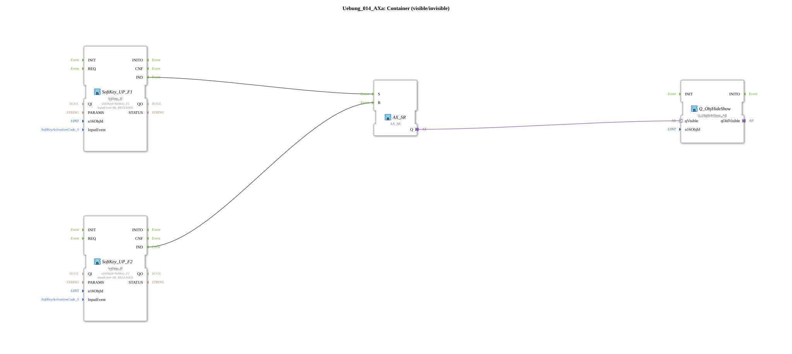

# Exercise_014_AXa: Container (visible/invisible)


* * * * * * * * * *
## Introduction
This exercise demonstrates controlling the visibility of a container (object) using two softkeys. SoftKey_F1 shows the container, and SoftKey_F2 hides it. A set-reset flip-flop (AX_SR) is used to store the state and pass it to a hide/show block.
## Function Blocks (FBs) Used

### SoftKey_UP_F1 (Type: isobus::UT::io::Softkey::Softkey_IE)
- **Parameters**:
- `QI` = TRUE
- `u16ObjId` = SoftKey_F1
- `InputEvent` = SK_RELEASED
- **Event Output/Input**: Event output `IND` (triggered when F1 is released)
- **Functionality**: This function block detects the release of the softkey F1 and outputs an event at its output `IND`.

### SoftKey_UP_F2 (Type: isobus::UT::io::Softkey::Softkey_IE)
- **Parameters**:
- `QI` = TRUE
- `u16ObjId` = SoftKey_F2
- `InputEvent` = SK_RELEASED
- **Event Output/Input**: Event output `IND`
- **Functionality**: Analogous to SoftKey_UP_F1, but for Softkey F2.

### AX_SR (Type: adapter::events::unidirectional::AX_SR)
- **Parameters**: No explicit parameters.
- **Adapter Connections**:
- Inputs: `S` (Set), `R` (Reset)
- Output: `Q` (State)
- **Functionality**: A set-reset flip-flop. An event on `S` sets the output `Q` to TRUE; an event on `R` resets it to FALSE. The state is retained until the next event occurs.

```
### Q_ObjHideShow (Type: isobus::UT::Q::Q_ObjHideShow_AX)
- **Parameters**:
- `u16ObjId` = Container_B
- **Adapter Connection**: `qVisible` (Adapter input, expects a Boolean value)
- **Functionality**: This function block controls the visibility of the object with the ID `Container_B`. If the value TRUE is present at the adapter `qVisible`, the object is made visible; if FALSE, it is hidden.

## Program Flow and Connections

The event outputs of the softkey blocks are connected as follows:

- The event `IND` of **SoftKey_UP_F1** is connected to the set input `S` of **AX_SR**.
- The event `IND` of **SoftKey_UP_F2** is connected to the reset input `R` of **AX_SR**.

The status output `Q` of **AX_SR** is forwarded to the block **Q_ObjHideShow** via the adapter `qVisible`.

**Process**:

1. When the operator releases softkey F1, a set event is sent to AX_SR. This sets the output `Q` to TRUE.

2. The TRUE value activates the function block **Q_ObjHideShow**, making the container `Container_B` visible.

3. When softkey F2 is released, a reset event is sent to AX_SR. `Q` is set to FALSE, and the container becomes invisible.

**Learning Objectives**:

- Controlling the visibility of an object using two softkeys.
- Using a set-reset flip-flop (AX_SR) for state storage.
- Connecting event and data adapters in a subapplication.

**Difficulty Level**: Easy

**Required Prior Knowledge**: Basic knowledge of event processing and adapter connections in 4diac.

## Summary

This exercise demonstrates a typical application for showing/hiding a container using two softkeys. The Set/Reset block stores the desired visibility state, which is then passed to the Hide/Show block via an adapter. This is a simple example of state control in industrial automation using 4diac.

---

### 🌐 Related topic subpages on ms-muc-docs.de
* [🌐 Eclipse 4diac IDE & Color Reference on ms-muc-docs.de](https://www.ms-muc-docs.de/iec-61499/eclipse-4diac/)

]
