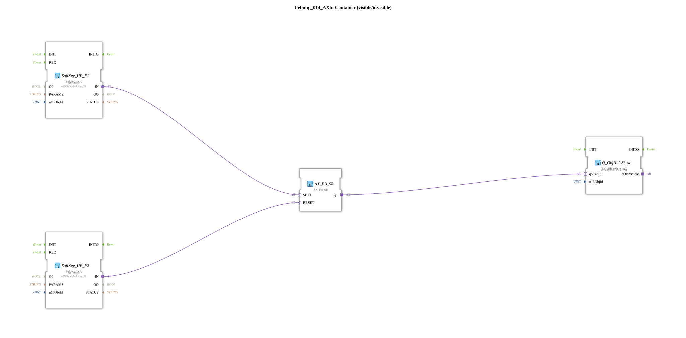

# Exercise_014_AXb: Container (visible/invisible)

* * * * * * * * * *
## Introduction

This exercise demonstrates the use of softkeys in combination with an SR flip-flop to show and hide a graphical object (Container_B). The function block monitors the key presses of the softkeys F1 (Set) and F2 (Reset) and controls the container's visibility via an SR gate. The associated constants *Container_B*, *SoftKey_F1*, and *SoftKey_F2* are imported from a global pool.

## Function Blocks (FBs) Used

### Sub-Blocks: Exercise_014_AXb

This exercise consists of a sub-application containing the following internal function blocks:

- **SoftKey_UP_F1**: `isobus::UT::io::Softkey::Softkey_IXA`

- Parameters: `QI` = `TRUE`, `u16ObjId` = `SoftKey_F1`

- Event Output: `IN` (on key press)

- Functionality: Monitors the F1 softkey and outputs an event at output `IN` as soon as the key is pressed.

- **SoftKey_UP_F2**: `isobus::UT::io::Softkey::Softkey_IXA`

- Parameters: `QI` = `TRUE`, `u16ObjId` = `SoftKey_F2`

- Function: Analogous to SoftKey_UP_F1, but for the F2 key.

- **AX_FB_SR**: `adapter::iec61131::bistableElements::AX_FB_SR`

- Parameters: None

- Inputs: `SET1` (event), `RESET` (event)

- Outputs: `Q1` (value)

- Function: An SR flip-flop (bistable element). When an event occurs on `SET1`, the output `Q1` is set to TRUE; when `RESET` occurs, it is set back to FALSE.

- **Q_ObjHideShow**: `isobus::UT::Q::Q_ObjHideShow_AX`

- Parameters: `u16ObjId` = `Container_B`

- Input: `qVisible` (value)

- Function: Controls the visibility of the object referenced by `u16ObjId` (Container_B). If the input `qVisible` = TRUE, the container is displayed; if FALSE, it is hidden.

## Program Flow and Connections

The connections within the subapplication are implemented as follows:

1. **SoftKey_UP_F1** – Pressing the F1 key → Event output `IN` is activated.

2. **SoftKey_UP_F2** – Pressing the F2 key → Event output `IN` is activated.

3. **AX_FB_SR** – The event input `SET1` is connected to the output of SoftKey_UP_F1. The event input `RESET` is connected to the output of SoftKey_UP_F2.

4. **Q_ObjHideShow** – The value input `qVisible` is connected to the output `Q1` of the SR flip-flop.

Procedure:

- Pressing the softkey **F1** sets the SR flip-flop, the output `Q1` becomes TRUE → the container is displayed.

- Pressing the softkey **F2** resets the flip-flop, `Q1` becomes FALSE → the container is hidden.

This exercise requires no additional data types or parameters. The user simply needs to press the two softkeys to control the container's visibility.

## Summary

This exercise implements a simple yet practical control pattern for visualization in an ISOBUS terminal. By combining softkey events, an SR flip-flop, and a visibility block, the behavior of an "on/off" switch for a graphical object is realized. This exercise illustrates the interplay of event and data flows in a 4diac sub-application and the use of predefined library components for ISOBUS communication.

---

### 🌐 Related topic subpages on ms-muc-docs.de

* [🌐 Eclipse 4diac IDE & Color Reference on ms-muc-docs.de](https://www.ms-muc-docs.de/iec-61499/eclipse-4diac/)

]