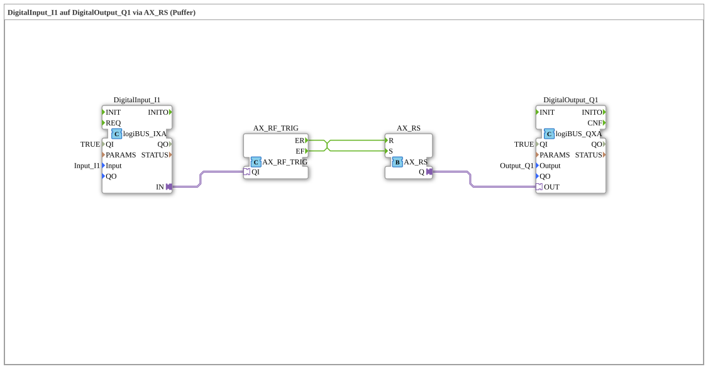

# Exercise_020a_AX: DigitalInput_I1 to DigitalOutput_Q1 via AX_RS (Buffer)

[(https://notebooklm.google.com/notebook/041f4df4-b729-484d-b786-b6dcdf151961)
This article describes the logiBUS® exercise `Uebung_020a_AX`, in which a digital input is routed to a digital output via RS memory logic
----

## Objective of the Exercise

The main objective of this exercise is to demonstrate the combination of event switches (`AX_SWITCH`) and memory elements (`AX_RS`) at the adapter level. While `Uebung_001_AX` uses a direct connection, this example shows how signals can be explicitly processed by events ("Set" on a rising edge, "Reset" on a falling edge).

-----

## Description and Components

[cite_start]The exercise consists of a subapplication (`Uebung_020a_AX.SUB`) that converts the state of an input into set/reset commands for a memory location via a switch [cite: 1].

### Function Blocks (FBs)

- **`DigitalInput_I1`**: Type `logiBUS_IXA`. Reads the physical input `Input_I1`.
- **`AX_SWITCH`**: An event switch. [cite_start]Passes the incoming adapter event to the output `EO1` (TRUE) or `EO0` (FALSE), depending on the logical state of the input `G` [cite: 1].
- **`AX_RS`**: An RS flip-flop with an adapter interface. It stores the state between events.
- **`DigitalOutput_Q1`**: Type `logiBUS_QXA`. Sets the physical output `Output_Q1`.

-----

## Functionality

The logic is implemented by linking the event outputs of the switch with the memory inputs:

<EventConnections>
<Connection Source="AX_SWITCH.EO0" Destination="AX_RS.R"/>
<Connection Source="AX_SWITCH.EO1" Destination="AX_RS.S"/>
</EventConnections>
<AdapterConnections>
<Connection Source="DigitalInput_I1.IN" Destination="AX_SWITCH.G"/>
<Connection Source="AX_RS.Q" Destination="DigitalOutput_Q1.OUT"/>
</AdapterConnections>

The process is as follows:

1. **Pressing I1**: The `IXA` block sends an event and the value `TRUE`. The `AX_SWITCH` forwards the event to `EO1` -> `AX_RS` is set (`S`) -> `Q1` is activated.
2. **Releasing I1**: The `IXA` block sends an event and the value `FALSE`. The `AX_SWITCH` forwards the event to `EO0` -> `AX_RS` is reset (`R`) -> `Q1` goes out.

As a result, the circuit behaves like a direct connection, but internally uses event-based memory logic.

-----

## Application Example

This pattern is the basis for **signal filtering or debouncing**. By inserting additional logic (e.g., timers) between the switch and the memory, it is possible to very precisely control the conditions under which a signal should "latch" or "drop out".
