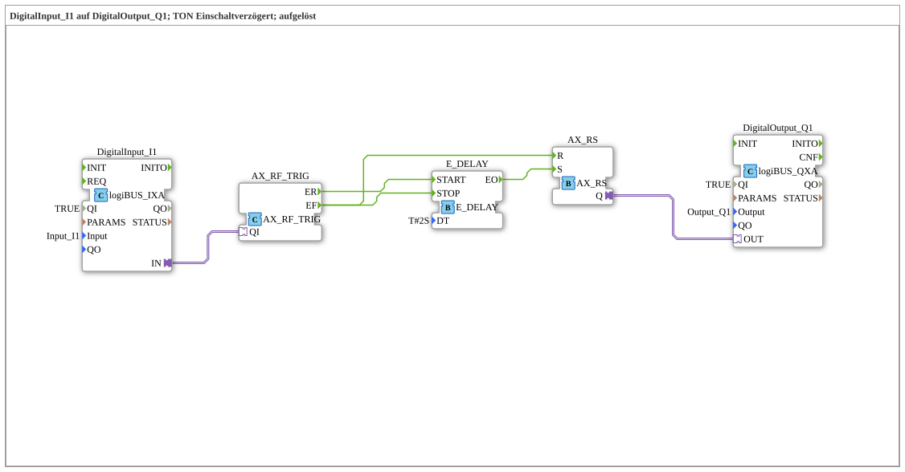

# Exercise_020b_AX: DigitalInput_I1 to DigitalOutput_Q1; TON Power-On Delay; resolved

This article describes the logiBUS® exercise `Uebung_020b_AX`. Here, a power-on delay (TON) is not used as a ready-made block, but is built from discrete event and memory blocks.
----
## Objective of the Exercise
The objective of this exercise is to deepen the understanding of the timing of events. Instead of using the ready-made `AX_TON` block (see `Uebung_020c_AX`), this demonstrates how a `E_DELAY` block can be integrated into a logic loop to achieve identical functionality.

-----

## Description and Components

[cite_start]The subapplication `Uebung_020b_AX.SUB` combines an event switch, a time delay, and an RS memory[cite: 1].

### Function Blocks (FBs)

* **`DigitalInput_I1`**: Type `logiBUS_IXA`. Signal input.
* **`AX_SWITCH`**: [cite_start]Passes the event to `EO1` on the rising edge and to `EO0` on the falling edge[cite: 1].
* **`E_DELAY`**: [cite_start]Delays an event arriving at the `START` input by the time `DT` (here 2 seconds)[cite: 1].
* **`AX_RS`**: The result memory.
* **`DigitalOutput_Q1`**: Type `logiBUS_QXA`. Signal output.

-----

## Functionality

The logic operates in three phases:

1. **Power-on (Start of Delay)**:

When `I1` is pressed, the switch sends an event to `E_DELAY.START`. The timer starts.

2. **Timeout (Switching)**:

After 2 seconds, `E_DELAY` fires at its output `EO`. This event sets the memory `AX_RS.S` -> `Q1` turns on.

3. **Shutdown (Instant Stop)**:

When `I1` is released, the switch sends an event to `EO0`. This event immediately stops any running timer (`E_DELAY.STOP`) and simultaneously resets the memory (`AX_RS.R`) -> `Q1` immediately turns off.

As a result, the light only illuminates if the button is held for at least 2 seconds. If it is released before then, nothing happens.

----

## Application Example

**Protection against incorrect operation**: A button for opening a heavy gate or starting a machine must be held for 2 seconds to prevent accidental activation.